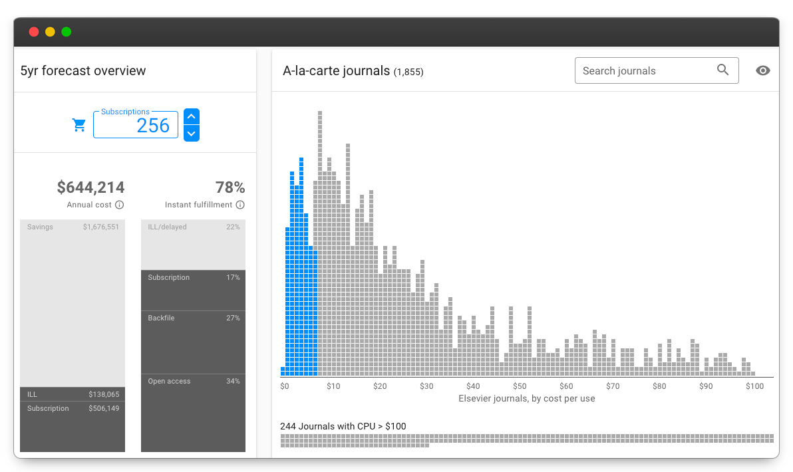

# Welcome!

Unsub is a dashboard that helps you reevaluate your big deal, and understand your cancellation options.&#x20;

This documentation is separated into four major sections oriented towards your learning goals:

* [Tutorials](tutorials/): Easy to follow step by step guides to getting started with Unsub. For example, [Create a package](tutorials/create-a-package.md)
* [How-to guides](how-to-guides/): Guides on solving specific problems. For example, [Upload title prices](how-to-guides/upload-title-prices.md)
* [Reference](reference/): Technical information about components of Unsub. For example, [Scenario parameters](reference/scenarios/scenario-parameters.md)
* [Background](how-it-works/): In depth articles geared towards understanding why. For example, [Are turnaways counted as usage?](reference/turnaways.md)

### Searching for documentation 

You can full-text search the Unsub documentation - just click Search in the upper right of this page and type out a query.

### Unsub mailing lists 

When your Unsub account is setup, the email address associated with the account does not automatically receive any emails with Unsub announcements.

We strongly recommend you sign up for these two google groups:

* [Unsub Announce](https://groups.google.com/forum/#!forum/unsub-announce) for important data and user interface updates
* [Unsub Discuss](https://groups.google.com/forum/#!forum/unsub-discuss) for user discussion

### Webinars and videos 

Check out our [Webinars](webinars.md) page for information about any upcoming webinars as well as links to webinar recordings.

### Feedback 

Don't hesitate to reach out to us ([support@unsub.org](mailto:support@unsub.org)) with questions or thoughts on Unsub itself, or any aspect of Unsub that could be better documented. We'd love your feedback!
