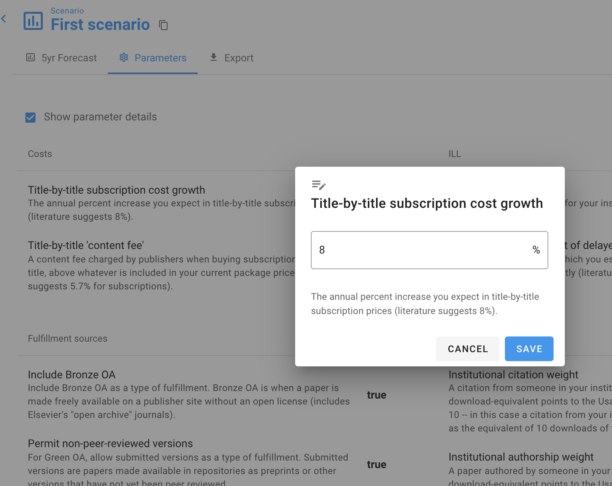

# Why is my journal title-by-title price not what I set it to be?

**Problem**: in the Publisher Setup tab, you've uploaded a title-by-title Journal Pricelist. Let's say you've uploaded a price of $1000 for The Journal of Example Studies.

Then you go to the forecast scenario, and look at the same journal--but the price is higher.

**Solution**: The price you uploaded is the _current_ annual price of the journal.

But on the scenario page, we're looking at your _forecasted_ annual price of this journal, averaged over the next five years. Everything in the Scenario view is about the future state of the world, over the next five years....specifically it's looking at the one-year average over the next five years.

The number in the scenario view is higher because, over the next five years, you will probably pay a higher price for this journal than you do now. When we forecast future journal prices, we include a term to model year-on-year increase in price. By default this is 8% (based on historical trends), but you can set it to any number you like, including 0%, by clicking Parameters➞Costs➞Title-by-title subscription cost growth.

