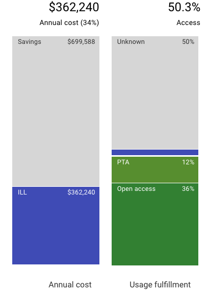

# Does Unsub account for Sci-Hub usage?

The Unsub Scenario view helps you visualize your fulfillment based on a variety of data inputs and parameter settings.

The "Unknown" portion of fulfillment (see figure below) can be a significant part of your fulfillment in some scenarios, especially if you have not added any title-by-title subscriptions. The Unknown grey portion of fulfillment is essentially "the reader is on their own".

A reader being on their own can mean many things, including asking the author of the paper for a PDF, asking a colleague for a PDF, and even using Sci-Hub.

You may be wondering if Unsub accounts for Sci-Hub in this grey Unknown portion of fulfillment.

Yes, Unsub does account for Sci-Hub, but not explicitly. Unsub has a parameter called "ILL Request Rate"; see [here](../reference/scenarios/scenario-parameters.md) and [here](how-do-we-calculate-ill-requests-and-ill-cost.md) for more on the ILL Request Rate parameter. This parameter has a default of 5%. That is, 1 out of every 20 times a paper is sought by a reader an ILL request happens. Presumably that rate goes down if people are using Sci-Hub more.

One way you could indirectly model different Sci-Hub usage levels is to change the ILL Request Rate parameter - comparing different Unsub scenarios with different ILL Request Rate values.
