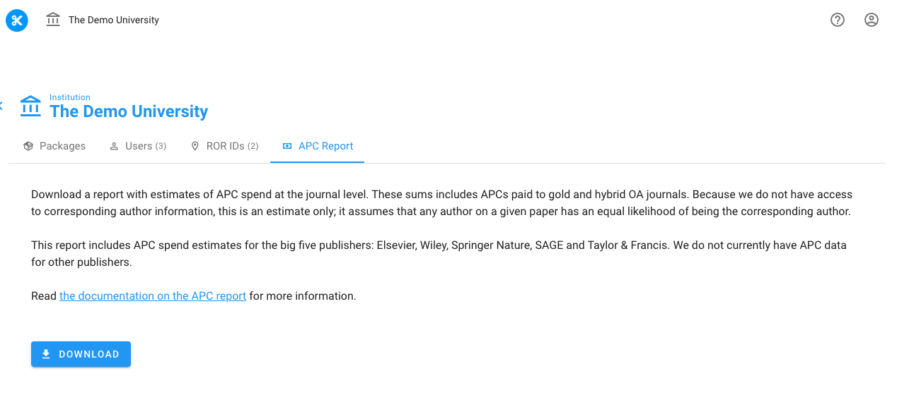

# APC Report

The APC report tab can be found at your institution.

Click the Download button to download a spreadsheet.

This report contains estimates of APC spend at the journal level. These sums includes APCs paid to gold and hybrid OA journals. Because we do not have access to corresponding author information, this is an estimate only; it assumes that any author on a given paper has an equal likelihood of being the corresponding author.

To find out more about where we get APCs, see [Where do the APC prices come from?](../how-it-works/where-do-the-apc-prices-come-from.md)

To find out how calculate our estimates of spend in this report, see [How do we calculate your OA Publish spend?](../how-it-works/how-do-we-calculate-your-oa-publish-spend.md)
