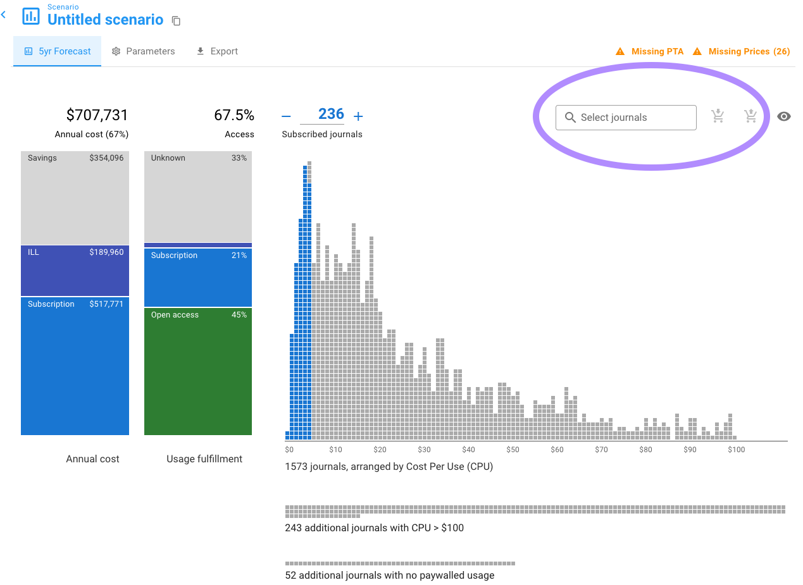
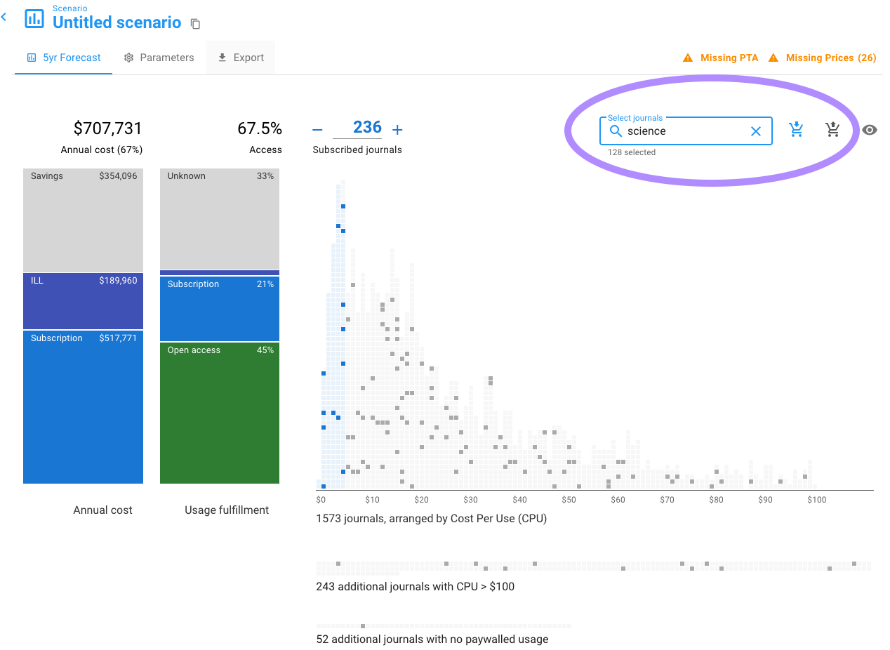
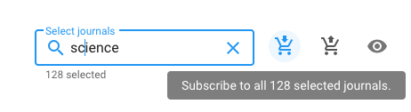
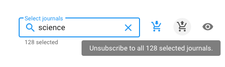

# Bulk subscribe/unsubscribe


For an overview of journal search/select check out [this page](select-journals.md).


We covered subscribing title by title in the tutorial [Subscribing title by title](../tutorials/subscribing-title-by-title.md), which centers around subscribing by our calculation of Cost Per Use.&#x20;

However, sometimes you want to subscribe to specific journals for whatever criteria you have that are not related to Unsub's [Cost Per Use](../reference/cost-per-use-cpu.md). For example, you may have done a faculty survey which created a certain set of titles you want to include in your subscribed titles.&#x20;

To subscribe/unsubscribe in bulk, go to the upper right of your Unsub dashboard.&#x20;

When there are no journals selected (see image below):&#x20;

* The subscribe and unsubscribe buttons are disabled and greyed out.&#x20;
* You can not click on them and you don't get a tooltip when hovering over them.&#x20;

When you do have journals selected due to text you've entered (see image below):&#x20;

* A grey text below the box will display the number of journals selected (e.g., "128 selected"). This is the total number selected, combining any that you can subscribe to and any to which you can unsubscribe&#x20;
* The subscribe and unsubscribe buttons will become blue and grey, respectively, if there are any journals to which you can subscribe or unsubscribe.&#x20;

You'll also see a tooltip if you hover over the subscribe or unsubscribe buttons:

After selecting the titles you're looking for, you can click the subscribe or unsubscribe icons. After clicking the icons you should see a change in your subscribed titles, whether it be adding or subtracting subscriptions.

You can delete your search text by clicking the X icon in the far right of the text box.
