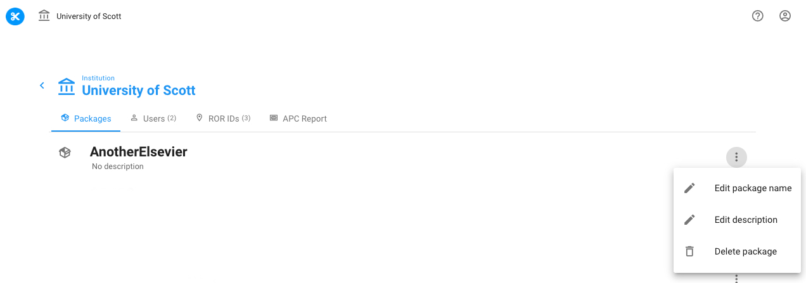
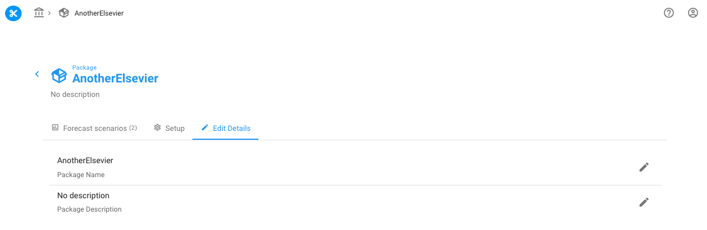

# Change package name or description

You can add a package name and package description when you create a package. See our [Create a package](../tutorials/create-a-package.md) tutorial for more.

After a package is created, you can change your package name and package description in one of two places.&#x20;

### An institution's list of packages

From your institution's list of packages, find the three vertical dots icon to the right of any package.

After clicking on either Edit package name or Edit description you'll get a popup that will have your current package name or description pre-filled. Edit the text, and when done click **Update**.

### Within a package

From within any package, find the tab called **Edit Details**.&#x20;

Click the pencil to the right of Package name or Package description to get a popup that will have your current package name or description pre-filled. Edit the text, and when done click **Update**.
