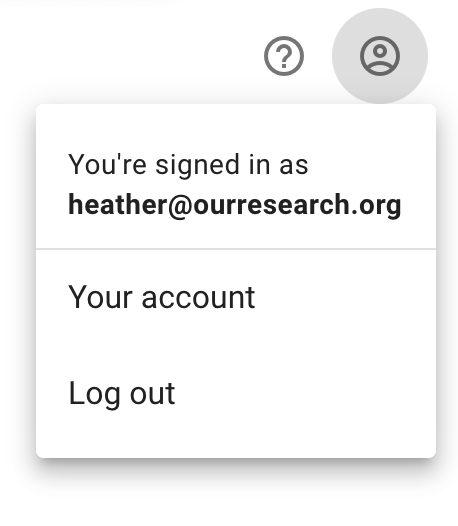
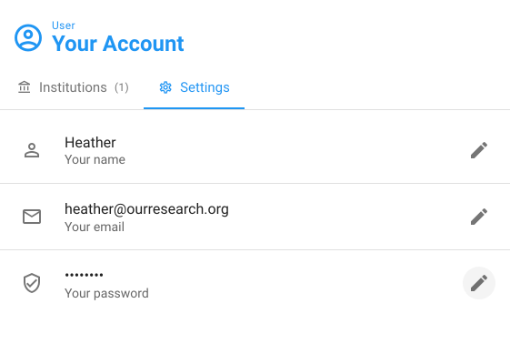
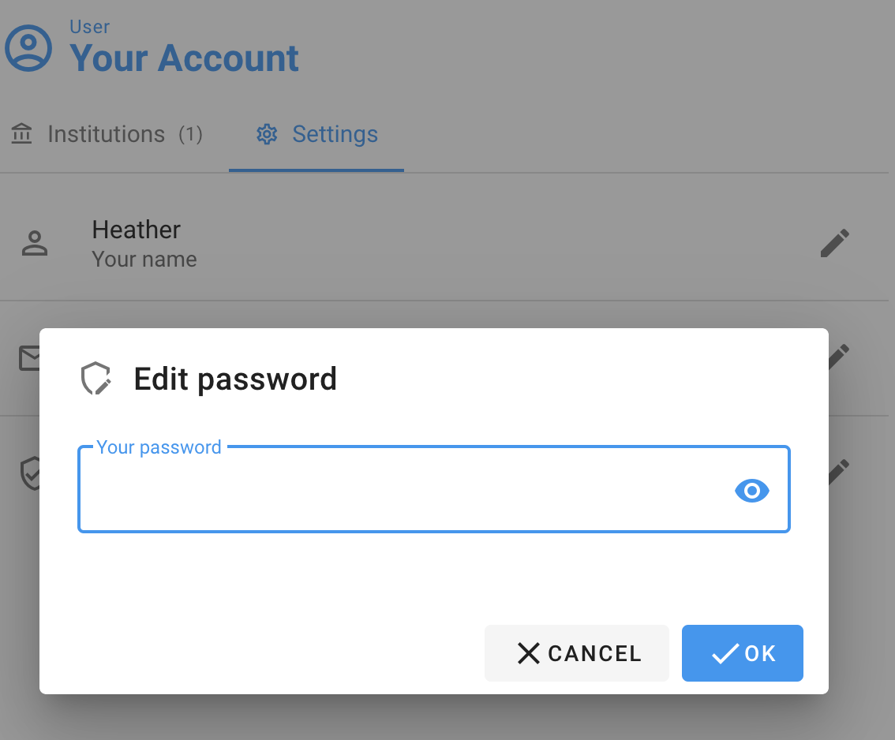
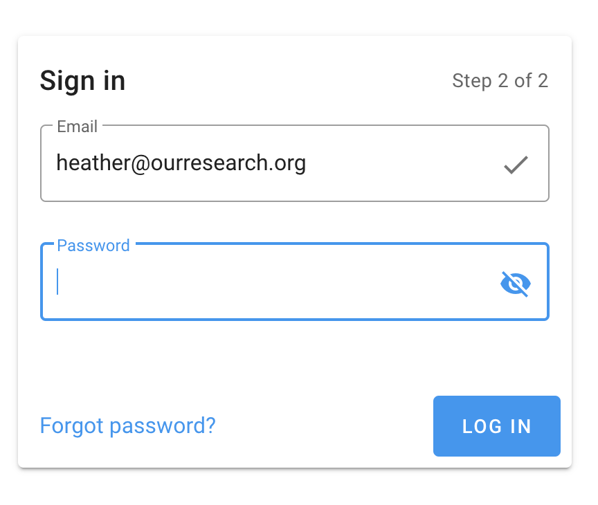

# Change your password

You can change your password on your account page. To get there, click the person icon at the top right of your screen, then select "Your account,"

To change your password, click the pencil icon next to "Your password" and an edit box will appear:

like this:

If you've forgotten your password, you can reset it on the login page using the "Forgot password?" link:

Or if you are ever stuck, email us at [support@unsub.org](mailto:support@unsub.org) with your email address and we'll reset it for you.
