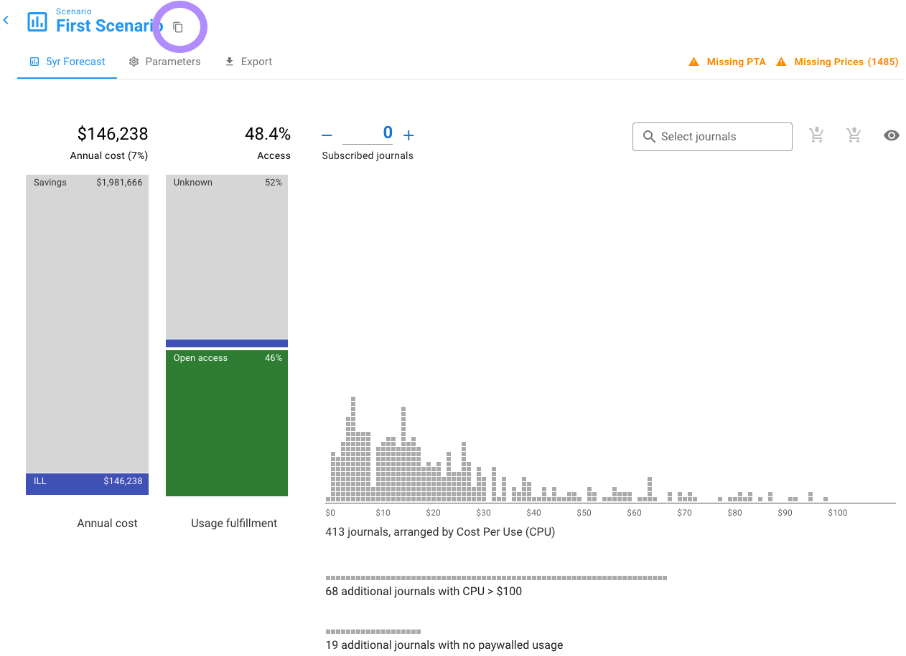
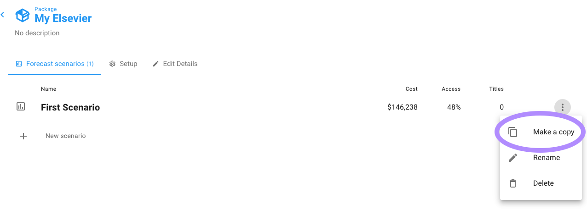

# Copy a scenario

If you already have a scenario, we recommend Copying a scenario instead of [Adding a new one](add-a-new-scenario.md) — a copied scenario copies all of the Parameter and Scenario settings so that you don't have to redo that work. To copy a scenario, on the Scenario page click the Copy icon to the right of the scenario name:

You will then be prompted to name your new scenario.

Alternatively, you can copy a scenario from the package page listing all of your scenarios within the package. From that page, click on the three vertical dots on the right-hand side of the scenario you want to copy, then click "Make a copy"

When the scenario is created you are dropped into the copied scenario - not the original scenario.&#x20;
