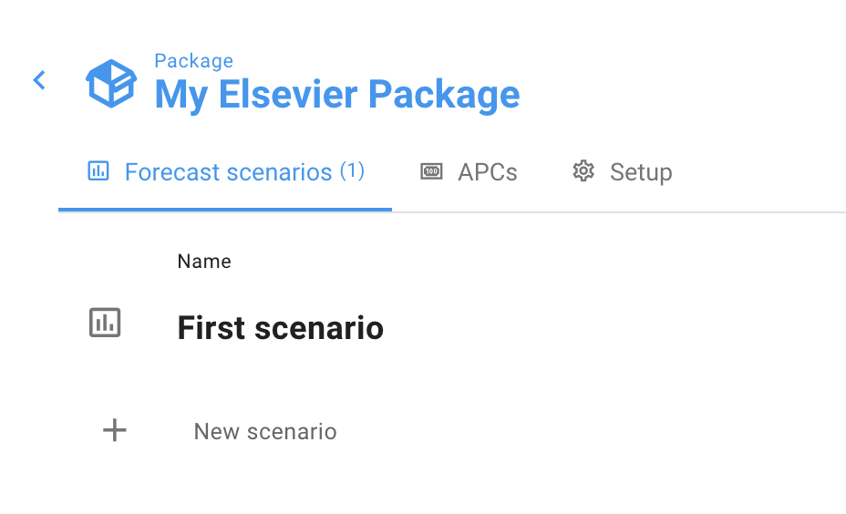
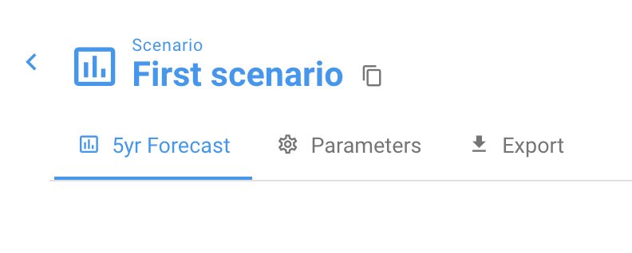

# How do I add a new scenario?

You can add a new Scenario to your Dashboard (so that you can compare different combinations of Parameters and Subscriptions across different scenarios) in one of two ways: Add or Copy.

To Add a scenario, click "+ New Scenario" on your scenarios list page:

If you already have a scenario, we recommend Copying a scenario instead of Adding a new one — a copied scenario copies all of the Parameter and Scenario settings so that you don't have to redo that work. To copy a scenario, on the Scenario page click the Copy icon to the right of the scenario name:

You will then be prompted to name your new scenario.
