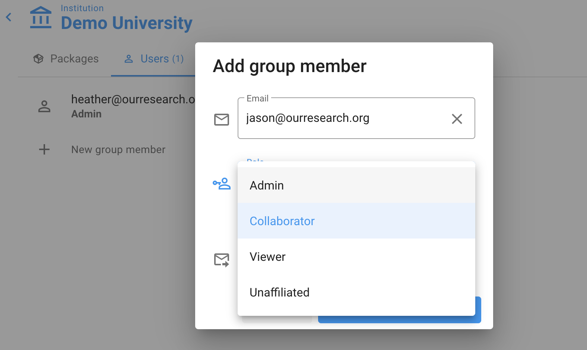

# Manage users

You can give other people access to your Unsub account, with different permissions. To do this, go to your institution page, then click on the Users tab. Click "New group member":

Add the new group member's email address, and choose a permission level for them.

There are four permissions levels:

* **Admin**: Full permissions, including adding and deleting other users (even you). Only give people you trust Admin rights.
* **Collaborator:** Full permissions for your institution's account, _except_ they can't add/delete other users or change other users' roles.
* **Viewer:** Read-only access to your institution's Unsub account.
* **Unaffiliated**: Can't access your institution's account at all.

We'll send this person an email with instructions on how to create their new account. Once they sign in, they'll automatically be granted access to your account, at the permissions level you chose.

### Deleting / Removing a user

There isn't currently an Unsub dashboard button for deleting/removing a user, but to achieve the result simply change the permission level for the user to **Unaffiliated.** After this change, they will no longer have access to your Unsub account.&#x20;
