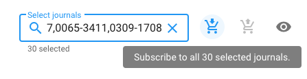

# Select journals

In the upper right of your Unsub dashboard (scenario) you will see:

* A search/select box
* A subscribe button - a shopping cart icon with a DOWN arrow
* An unsubscribe button - a shopping cart icon with an UP arrow&#x20;

Note: The eye icon is for toggling between histogram and table view (and isn't related to the topic of this article)

When there are no journals selected (see image below):&#x20;

* The subscribe and unsubscribe buttons are disabled (greyed out, you can not click on them and you don't get a tooltip when hovering over them)

When you do have journals selected due to text you've entered (see image below):&#x20;

* The grey text below the box will display the number of journals selected (e.g., "128 selected"). This is the total number selected, combining any that you can subscribe to and any to which you can unsubscribe&#x20;
* The subscribe and unsubscribe buttons will become blue and grey, respectively, if there are any journals to which you can subscribe or unsubscribe.&#x20;

You'll also see a tooltip if you hover over the subscribe or unsubscribe buttons (see last image below)

