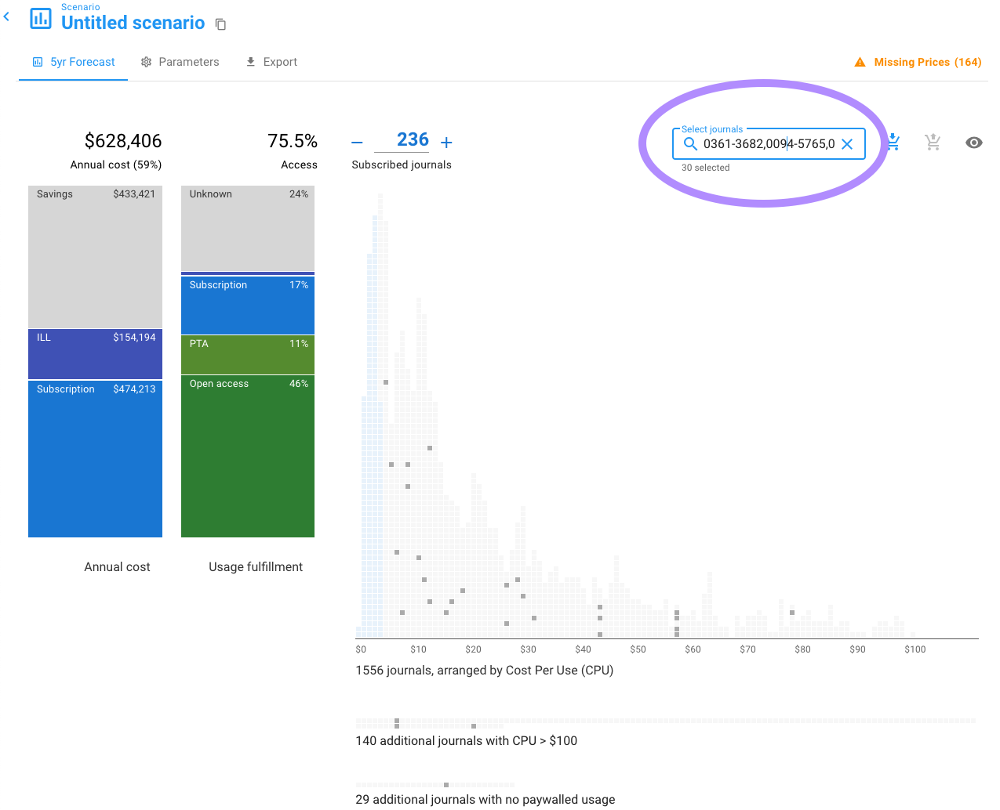

# Select journals

In the upper right of your Unsub dashboard (scenario) you will see a search/select box.&#x20;

You can use this feature of Unsub for a few use cases:

1. Find journals in your dashboard matching a comma-separated list of ISSNs, e.g, "1878-8750,1876-2018,2468-6964". All of your favorite spreadsheet editors have a way to generate a comma-separated list of cell contents, including ISSNs. This use case will be especially useful when you are determining some set of titles you want to subscribe to in Unsub based on variables Unsub does not have, e.g., faculty survey data.&#x20;
2. Find journals in your dashboard matching a text string, e.g., "science". This searches journal titles only

When you have journals selected due to text you've entered (see image below):&#x20;

* The grey text below the box will display the total number of journals selected (e.g., "30 selected").
* In histogram view, the journals selected in the histogram will retain their original colors, while the unselected journals will fade to a light grey - making the selected journals easier to pick out
* In table view, the table will be filtered to only the journals selected

The two icons to the right of the search/select box will be covered in the next article on [bulk subscribe/unsubscribe](bulk-subscribe-unsubscribe.md).

If your search text finds no matches in histogram view no titles (grey boxes) will be highlighted.

If your search text finds no matches in table view you will see an alert like that below - you can click on the small circled question mark to get to this documentation page.

