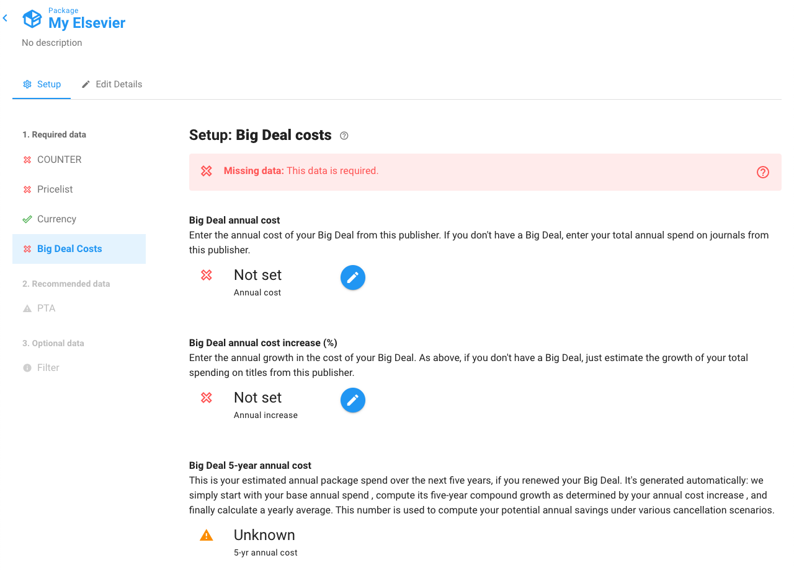

# Set Big Deal costs

Before you can use Unsub you have to set your Big Deal cost and inflation rate. Unsub uses this information to calculate your savings under alternative subscription scenarios.

If you don't have a Big Deal, then use your current Package Price, or whatever amount it is that you have been paying for subscriptions.

You set this price in the Package setup — it is one of the required tabs on the left:

Click the pencil icons to set both the "Big Deal annual cost" and the "Big Deal annual cost increase." The "Big Deal 5-year annual cost" will then calculate automatically.

If you don't know your cost or inflation, you can use an estimated value.
