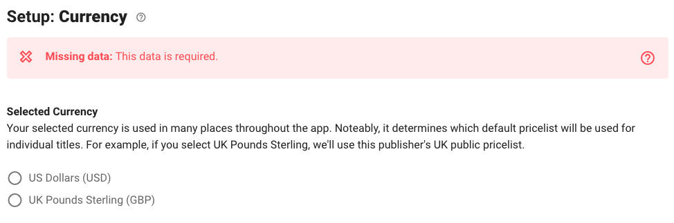

# Set currency

Currently we support UK pounds sterling (GBP) and US dollars (USD).

To change your currency, go to the Package page (you can click its name in the top left corner of your screen), then view the Setup tab, and finally select the "Currency" menu option. Select the currency you want to use.

It's important to note that changing currency doesn't _convert_ from one currency to another. If you select a new currency, don't forget to update costs you've already entered, replacing them with ones denominated in your new currency.

Specifically, you'll need to edit your package [Big Deal Cost](set-big-deal-costs.md) and scenario [ILL Transaction Cost parameter.](http://help.unsub.org/en/articles/4938030-scenario-parameters) You'll also need to [replace your custom pricelist](http://help.unsub.org/en/articles/4203886-how-do-i-upload-a-custom-title-by-title-journal-pricelist) if you've already loaded one that had prices in your old currency.

We do plan to support other currencies, based on demand. If you've got a currency you'd like to see supported, please let us know!
