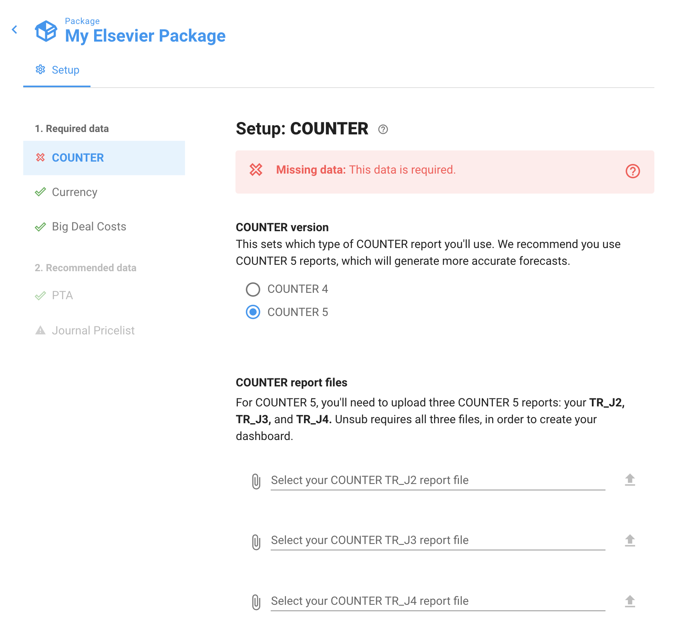
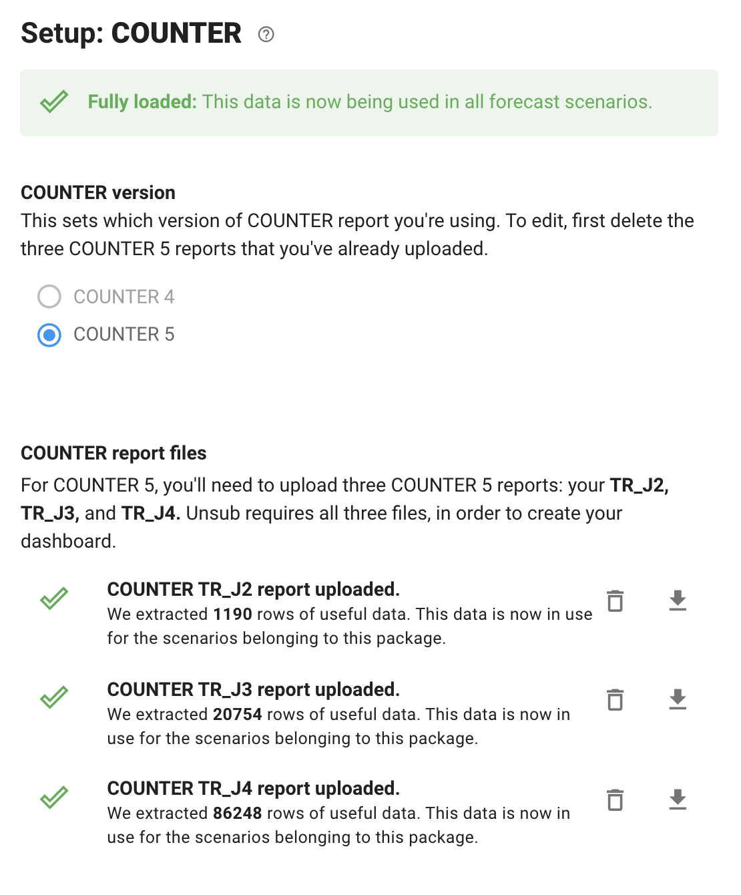

# Upload COUNTER usage data

Before you can use Unsub to analyze and forecast your subscriptions, you'll need to upload your COUNTER data. Unsub uses this to customize its forecasting model to your particular institution.

To start, navigate to the Setup of your Package. The COUNTER tab will look like this:

We recommend using COUNTER 5 data for new packages, though COUNTER 4 is still supported.

If you have previously loaded COUNTER 4 data to a package, you can easily replace it with COUNTER 5 data by deleting the existing COUNTER 4 file (click on the Trash can to its right), then pick the COUNTER 5 radio button and uploading COUNTER 5 data as described below. All your Forecast Scenario calculations will automatically update to use the new data.

As you get your COUNTER files ready, keep this in mind:

* Unsub needs three COUNTER 5 files: a TR\_J2, TR\_J3, and TR\_J4 (COUNTER 4 needs a JR1)
* Only these file formats are supported: .**csv, .xls,** and **.xlsx**
* There can be only one sheet in the file you upload
* Unsub expects the COUNTER data to cover 12 months of usage. This can be calendar year 2020, calendar year 2019 (if you think your usage patterns in 2020 were particularly unusual), or any other consecutive 12 month period.
* Files can not contain formulas or other non value contents. We don't currently handle files that have non-value contents like formulas.

Once you've got your COUNTER files, you're ready to start the uploads. Click the Paperclip, select your file, and then click the Up arrow button. Unsub will begin uploading and processing the files.

The upload and processing will take several minutes... some of these files are big! Once it is done, you'll see something like this:

You can click on the download arrows to the far right of each file to see what we have stored. If you'd like to replace this data later you can click the Trash can to the right of the row and then upload a new file — your scenario forecasts will automatically recalculate to use the new data.

Note that because COUNTER files include Open Access journals, journals that have stopped publishing, and journals that have moved to a different publisher, not all of the journals in your COUNTER files will appear in your Forecast dashboards. Furthermore, if you are missing price data, those journals will be missing even if they are currently publishing and have COUNTER usage ([see here to correct this](http://help.unsub.org/en/articles/4203886-how-do-i-upload-a-custom-title-by-title-journal-pricelist)).

\
