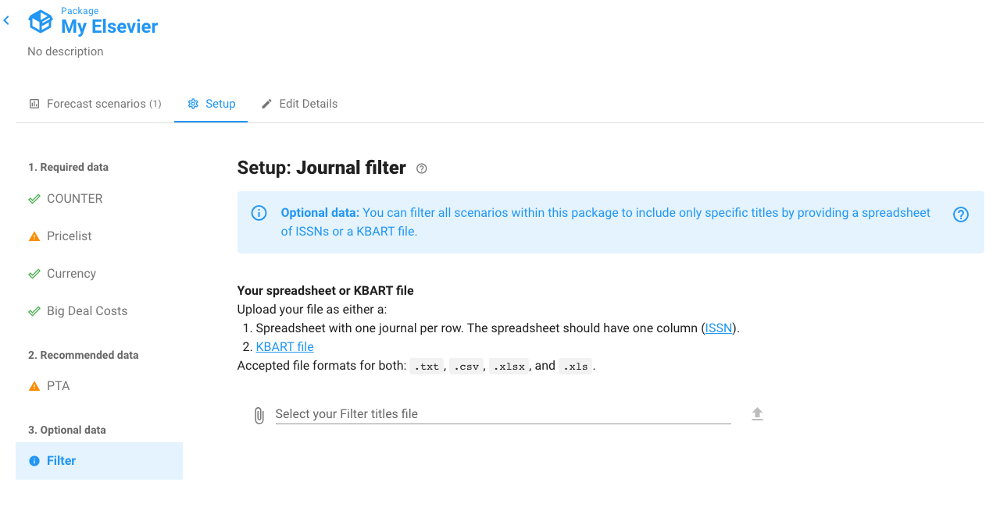
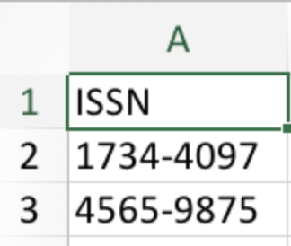
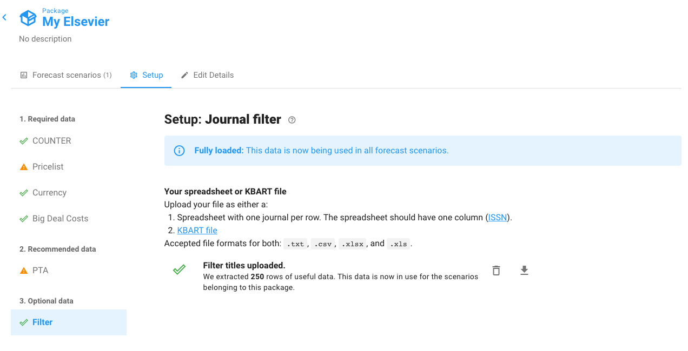
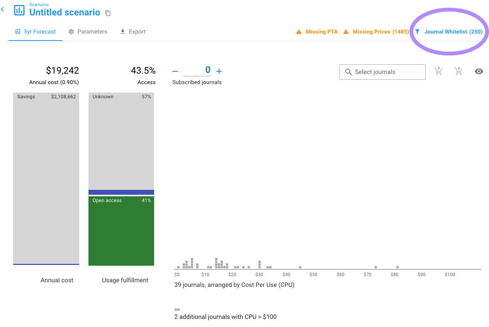

# Upload journal filter

Any Unsub dashboard supports journals from any publisher. However, Unsub started off with each dashboard being concerned with one publisher. Thus, you may be used to, for example, uploading COUNTER reports for Elsevier and be expecting to see only Elsevier journals in your dashboard.&#x20;

As we now support all publishers - including a mix of publishers - we no longer filter titles in a dashboard by publisher. All titles are included from COUNTER report you upload as long as they do not fall under one or more of [these three reasons](../troubleshooting/why-dont-i-see-a-certain-title-in-my-dashboard.md).

To address the lack of filtering by publisher, we now support user supplied title filtering. Filtering titles is **optional**.

### Filtering titles

First, navigate to the package you're interested in, click the Setup tab, and scroll to the Filter section:

As you can see, there is a warning that you are missing  data.

If you upload a KBART file, make sure to edit the file to only the ISSNs you want to whitelist.

Let's fix that by uploading a custom file. The file is pretty simple, just a spreadsheet with one column: **ISSN**.

Here's an example:

To upload your file, click the Paperclip, then find your file and select it, then click the Upload arrow. You'll wait a minute or two while Unsub starts to upload and process the file. Then when it's done, you'll see something like this:

We can see there were 250 rows of useful data. You can click on the download arrow to the far right to view the journals used to filter the titles in your your dashboards.

If you'd like to replace this data later you can click the Trash can to the right of the row and then upload a new file — your scenario forecasts will automatically recalculate to use the new data.

Upon returning to any scenario within the package you should now see a blue message "Journal Whitelist (some number)" in the upper right hand corner. For example:

You can click on the blue "Journal Whitelist" text to get to this documentation page.

Importantly, the titles that you see in your dashboard may not match exactly to the titles uploaded in the Journal Filter setup step. These are some of the situations you could encounter after filtering:

* The number of titles in your scenario is unchanged. This could be because the titles you filtered to matched exactly the titles already in your dashboard.&#x20;
* The number of titles in your scenario has gone down but you still have some titles. This should be the most common case.
* There are no titles in your dashboard. This could happen if you filter by ISSNs that are valid, but do match any titles in your dashboard.

If you have a different situation, or any questions about any of this please get in touch at [support@unsub.org](mailto:support@unsub.org)
