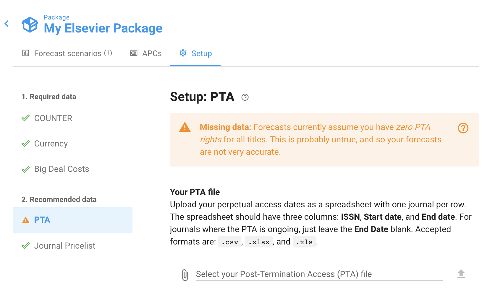
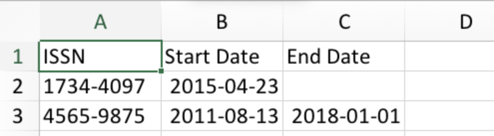
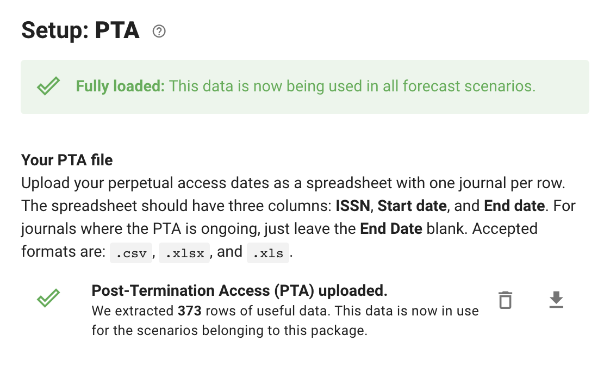

# Upload PTA data

A key data source for Unsub is the Post-Termination Access dates of each journal — the range of content you'll still have access to, even after a cancellation. If you cancel a Big Deal, PTA to back content will become an important source of fulfillment, especially over the first few years.

Of course, this will vary, depending on the journal. In some fields (like math or philosophy), back content stays relevant for a long time, and so PTA is quite significant. In other (like biomed), readers are disproportionately reading brand-new articles, and so PTA doesn't impact post-cancellation fulfillment that much. The Unsub model accounts for all this, using a training set composed of millions of data points from thousands of libraries, and customized it to your institution using your COUNTER data.

**By default, the model assumes that you have no PTA rights to any of the journals in your COUNTER data**. However, this is probably not the case, and so **likely underestimates your post-cancellation access**. You can upload a list of your actual PTA date ranges by journal, and Unsub will recalculate your forecasts using that data.

Here's how.

First, navigate to the publisher you're interested in, click the Setup tab, and scroll to the PTA section:

As you can see, there is a warning that you are missing PTA data.

Let's fix that by uploading a custom file. The file is pretty simple, just a spreadsheet with three columns: **ISSN**, **Start Data**, and **End Date**. A few other tips:

* For the dates, we prefer an [ISO 8601](https://en.wikipedia.org/wiki/ISO\_8601) format like this: **YYYY-MM-DD**. However, we make our best guess at dates in other formats as well, and they generally work.
* If a journal's PTA is ongoing, leave the End Date blank.

Here's an example:

To upload your file, click the Paperclip, then find your file and select it, then click the Upload arrow. You'll wait a minute or two while Unsub starts to upload and process the file. Then when it's done, you'll see something like this:

Looking at the "Your PTA file" section, we can see there are now 373 journals where the model will using our custom date ranges. You can click on the download arrow to the far right to view the journals and the ranges being used.

If you'd like to replace this data later you can click the Trash can to the right of the row and then upload a new file — your scenario forecasts will automatically recalculate to use the new data.\

