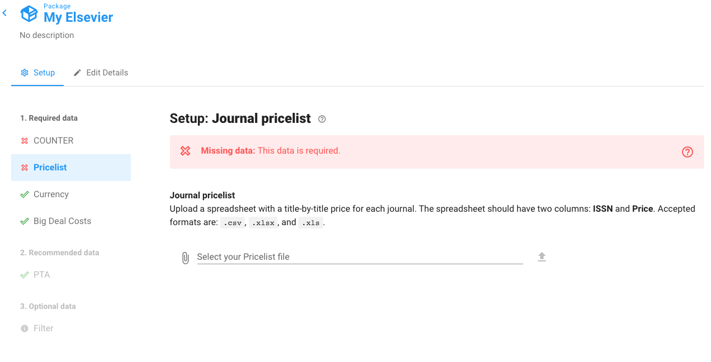
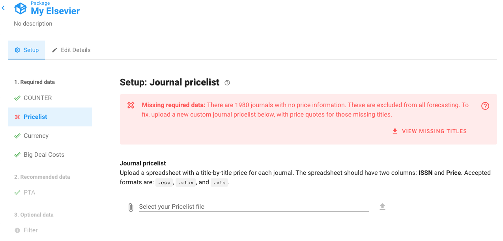
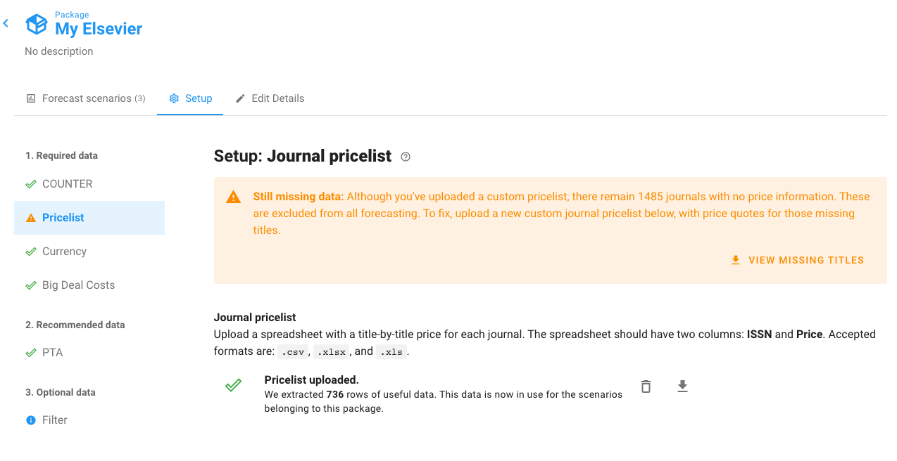
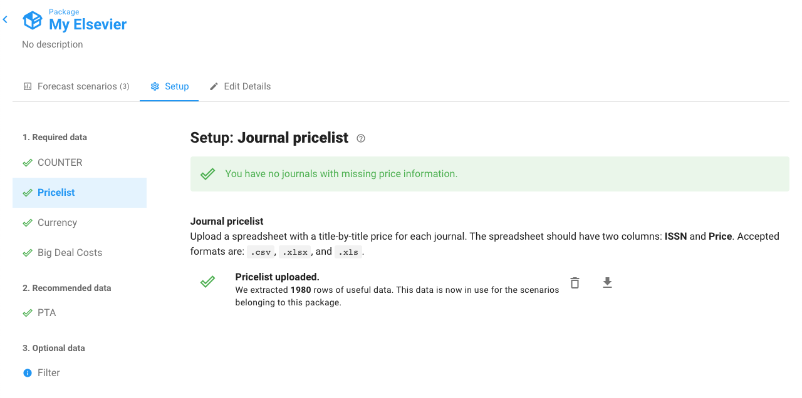

# Upload title prices

A key data source for Unsub is the title-by-title price for each journal — the actual real-world cost you'll pay, if you choose to subscribe to that journal individually outside any Big Deal. For any given journal, there are two sources for the title-by-title price:

1. **Custom uploaded price:** You can upload a simple spreadsheet with custom prices for each journal. Any custom prices you upload will be interpreted in the currency you have chosen for your package.
2. **No price:** If you didn't upload a list price for a journal, then the price is unknown. In that case, this journal will be _omitted from forecasting,_ because we don't know how they will affect the financial side of the model.


Public list price: We used to provide public list prices. We no longer provide them. See the [Getting Title Prices](getting-title-prices.md) page for help.


You can see the source of price data for each journal by going to your institution page, clicking the package you are interested in, opening the Setup tab, and then clicking the "Pricelist" section.

If you don't have any title prices uploaded, you will see one of two screens:&#x20;

* COUNTER reports **have not been uploaded**. The message on the pricelist page states simply that pricelist data is required.

* COUNTER reports **have been uploaded**. The message states that the pricelist data is required, and tells you how many titles are missing price information.

If you click on "View Missing Titles", you will download a spreadsheet with the ISSNs, Titles, and an approximate sum of your COUNTER data for that title (column named "counter\_total") so that you know how important it is to you to make sure you get the price reflected in your Unsub dashboard. The "counter\_total" column includes only data from your COUNTER reports; it does not include citations or authorships data that you see in the Unsub dashboard. The file looks like:

.png>)

Once you have your price data available, the format needed for Unsub is really simple. It's just two columns: **ISSN** and **Price**. You include a row for every journal where you have a custom price to set. The prices are interpreted in the Currency you set in your Package Setup (currency symbols are ignored). The file needs to be in .csv, .xlsx, or .xls format with just one sheet. Files can not contain formulas or other non value contents. We don't currently handle files that have non-value contents like formulas. Here's an example:


Do not use a thousands comma or period separator in the Price column


To upload, just click the Upload button, then click the Paperclip, find your file and select it, then click the Upload arrow. You'll wait a minute or two while Unsub starts to upload and process the file. Then when it's done, you'll see something like this:

If you want to see the prices you have uploaded you can click the download button on the far right of the file row. If you'd like to replace your Custom journal pricelist, click the garbage can to the right of the file row and then upload your new file.

Note that the red alert has given way to an orange alert - indicating that required data has been uploaded but that there are still missing prices.

If you do happen to get all title prices you will see something like the screen below with a green alert and check mark:


Unsub only supports pricing at the single-journal level. For more on how to address mini-bundle pricing see [this article](mini-bundle-pricing.md).

