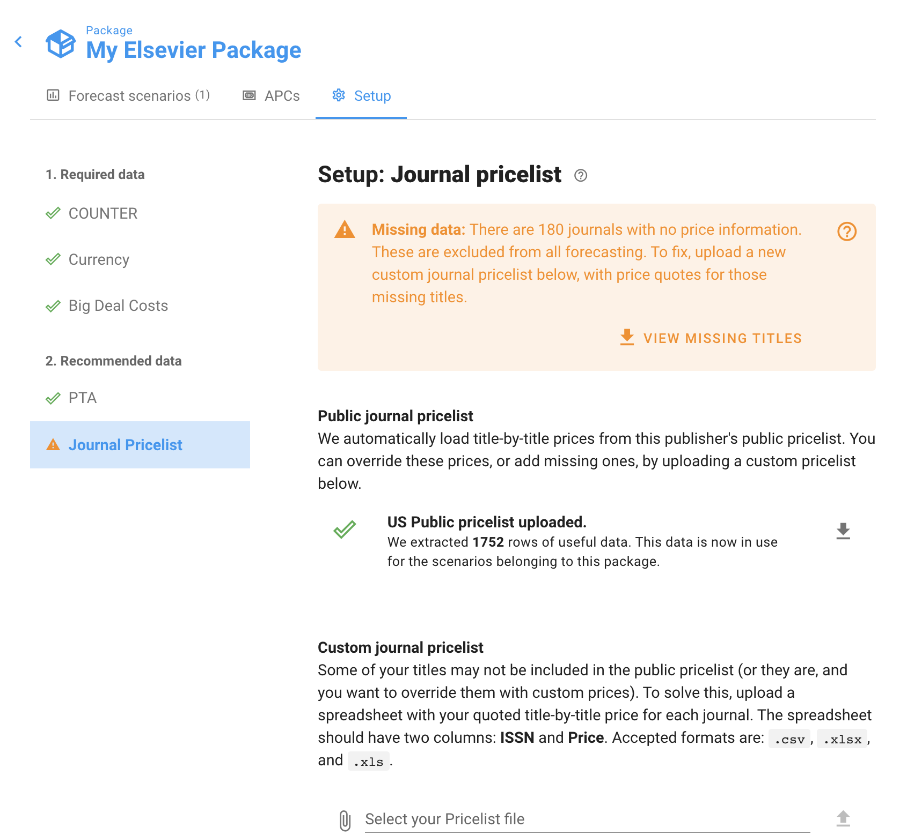
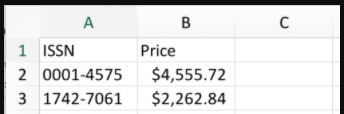
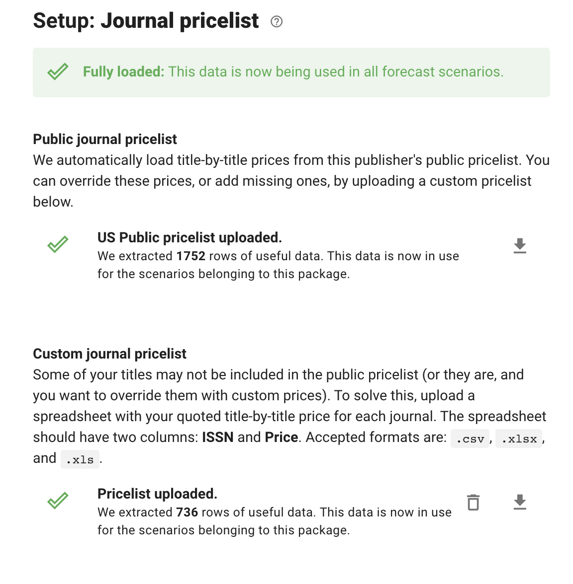

# Upload title prices

A key data source for Unsub is the title-by-title price for each journal — the actual real-world cost you'll pay, if you choose to subscribe to that journal individually outside any Big Deal. For any given journal, there are three different sources for the title-by-title price:

1. **Public list price:** This is the title-by-title subscription price from the publisher's website. By default, Unsub uses public list price where we can find it in your currency.
2. **Custom uploaded price:** You can upload a simple spreadsheet with custom prices for each journal. Any custom prices you upload will override the default list prices, and be interpreted in the currency you have chosen for your package.
3. **No price:** If we couldn't find a public list price for a journal in your currency and you haven't uploaded a custom price for it, then the price is unknown. In that case, this journal will be _omitted from forecasting,_ because we don't know how they will affect the financial side of the model.

You can see the source of price data for each journal by going to your institution page, clicking the publisher you are interested in, opening the Setup tab, and then clicking the "Journal Pricelist" section.

We can see at the top that there are 180 Journals with no price data, and 1,752 journals with price data from the default public price list.

To see which journals are missing prices, so that you can ask your Sales Rep for the pricelist, click "View Missing Titles" on the warning box. This will download a spreadsheet with the ISSNs, Titles, and an approximate sum of your COUNTER data for that title (column named "counter\_total") so that you know how important it is to you to make sure you get the price reflected in your Unsub dashboard. The "counter\_total" column includes only data from your COUNTER reports; it does not include citations or authorships data that you see in the Unsub dashboard. &#x20;

Once you have your price data available, the format needed for Unsub is really simple. It just needs two columns: **ISSN** and **Price**. You include a row for every journal where you have a custom price to set. The prices are interpreted in the Currency you set in your Package Setup (currency symbols are ignored). The file needs to be in .csv, .xlsx, or .xls format with just one sheet. Files can not contain formulas or other non value contents. We don't currently handle files that have non-value contents like formulas. Here's an example:

To upload, just click the Upload button, then click the Paperclip, find your file and select it, then click the Upload arrow. You'll wait a minute or two while Unsub starts to upload and process the file. Then when it's done, you'll see something like this:

If you want to see the prices you have uploaded, or see the public pricelist, you can click the download button the the far right of the file rows. If you'd like to replace your Custom journal pricelist, click the garbage can to the right of the file row and then upload your new file.

Note that Unsub only supports pricing at the single-journal level. For more on how to address mini-bundle pricing [see this article](http://help.unsub.org/en/articles/4988087-how-to-handle-mini-bundle-pricing).
