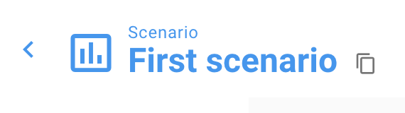

# Scenario Parameters

Unsub provides a number of Parameters to let you customize a Scenario to your institution's environment and to experiment with different assumptions about the future.

Parameter values are stored as part of the scenario. Parameter values can be changed using the "Parameters" menu. You can make a new scenario that has the same parameter settings as a current scenario using Copy button to the right of the scenario title on a scenario page:

### &#x20;

### Costs 

**Title-by-title 'content fee'**

A content fee charged by publishers if you buy subscriptions title-by-title (literature suggests 5.7% for subscriptions).

Default: 5.7%

**Title-by-title subscription cost growth**

The annual percent increase you expect in title-by-title subscription prices (literature suggests 8%).

Default: 8%

### &#x20;

### ILL 

**ILL transaction cost**

The cost of an ILL request for your institution (literature suggests $17 is average).

Default: $17

**ILL Request Rate**

The percent of turnaways that will result in an ILL request. Our extensive literature review suggests 5% is a conservative estimate. (NB: 'Turnaways' are all usages that aren't fulfilled by Open Access, PTA rights, or title-by-title subscriptions in this scenario.)

Default: 5%

### &#x20;

### Fulfillment Sources 

**Include Bronze OA**

Include Bronze OA as a type of fulfillment. Bronze OA is when a paper is made freely available on a publisher site without an open license (includes Elsevier's "open archive" journals).

Default: True

**Permit non-peer-reviewed versions**

For Green OA, allow submitted versions as a type of fulfillment. Submitted versions are papers made available in repositories as preprints or other versions that have not yet been peer reviewed.

Default: True

**Include ResearchGate-hosted content**

Include ResearchGate and other Academic Social Networks as a fulfillment source.

Default: True

### &#x20;Citation and Authorship

**Institutional citation weight**

A citation from someone in your institution contributes this many download-equivalent points to the Usage of the journal. A common value is 10 -- in this case a citation from your institution to this journal is modeled as the equivalent of 10 downloads of this journal.

Default: 10

**Institutional authorship weight**

A paper authored by someone in your institution contributes this many download-equivalent points to the Usage of the journal. A common value is 100 -- in this case an authored paper in this journal is modeled as the equivalent of 100 downloads of this journal.

Default: 100

\
