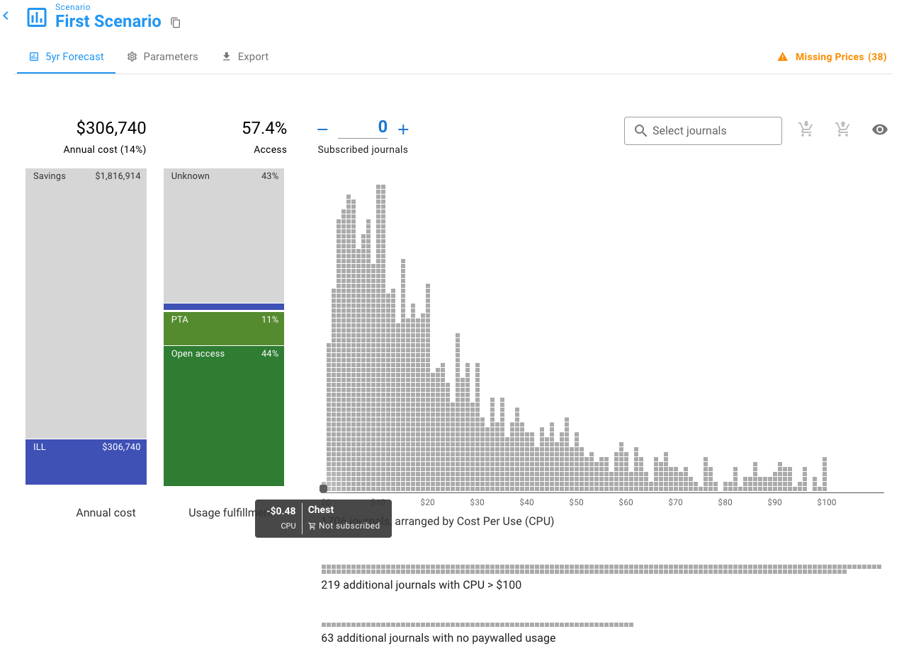
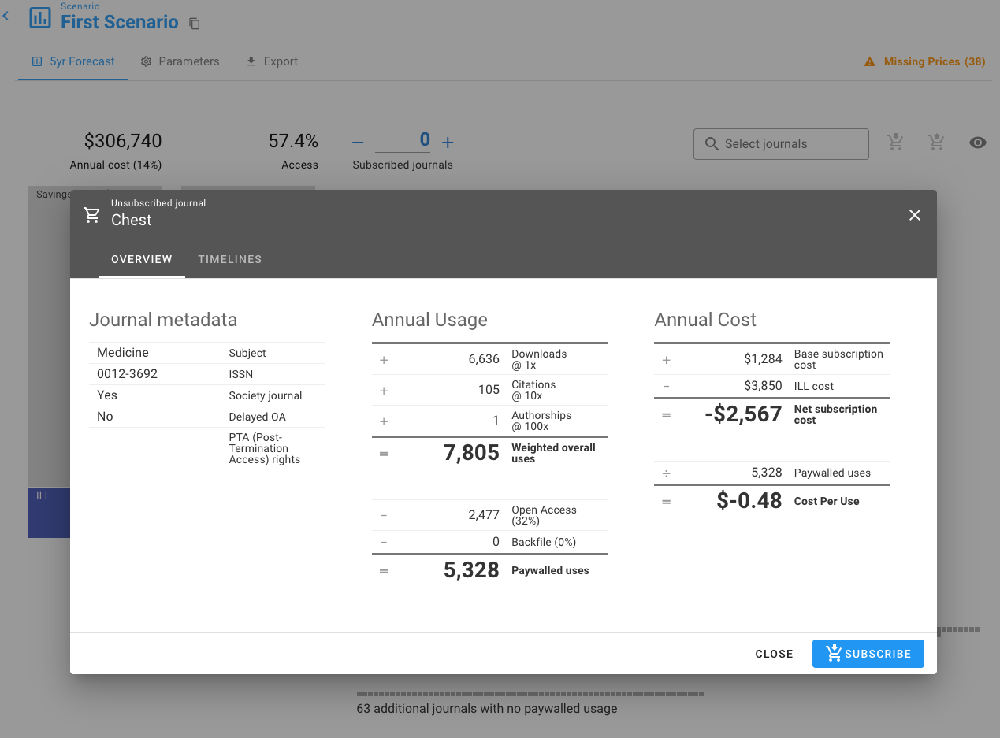
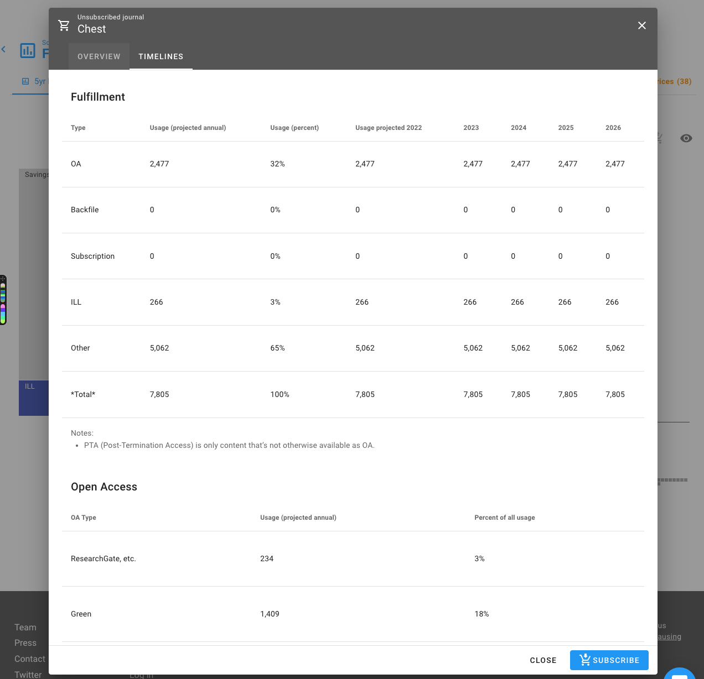

# Single Journal View

In histogram or table view in an Unsub scenario you can click on any journal to get to the single journal view.&#x20;

For example, if we click on the box for the journal **Chest**

we then get a zoom view of that journal:

This zoomed view of a single journal contains journal metadata and a breakdown of the [Cost Per Use](cost-per-use-cpu.md) calculations.&#x20;

On this single journal zoom you can subscribe or unsubscribe if you're already subscribed to the journal.

### Overview

The overview tab contains journal metadata, annual usage, annual cost, and the CPU value.

#### Journal metadata

This section of the single journal view contains:&#x20;

* Subject: a single subject from OpenAlex concepts - see [Data export](data-export.md) for more information.
* ISSN: the Linking ISSN (or ISSN-L)
* Society Journal: Whether the journal is a society journal ("Yes") or not ("No"). &#x20;
* Delayed OA: Whether the journal a delayed OA journal ("Yes") or not ("No"). If "Yes", then the journal makes content free to read after an embargo period has passed - and there will be an additional row below "OA embargo length" that gives the length in months.
* PTA (Post-Termination Access) rights: This is empty if you have not uploaded PTA rights for the journal, and gives the start and end years if you have uploaded PTA rights for the journal.


Numbers are rounded! If you try to do the math yourself you may end up with slightly different results - which should always be due to rounding. If you're still not sure, get in touch at [support@unsub.org](mailto:support@unsub.org)



Numbers are forecasted numbers. They will not match current day numbers you may have.


#### Annual usage

**Weighted overall uses** is three components combined:

* Downloads: forecasted downloads (or usage) derived from the COUNTER reports you uploaded.
* Citations: forecasted citations to the journal from any published paper (in any journal, including this one) by members of your institution.
* Authorships: forecasted authorships in the journal by members of your institution.

Then we want to get to **Paywalled uses** because we don't want to factor free usage into our CPU calculation. To arrive at **Paywalled uses** we subtract from **Weighted overall uses**:

* Open access usage: forecasted open access usage
* PTA/Backfile usage: forecasted usage via PTA/backfile

#### Annual cost

Cost is not just the base subscription cost as you might be used to. We want to account for the cost of ILL because the opposite of subscribing is not free. There is a cost to ILL.&#x20;

To get to **Net subscription cost** we subtract forecasted ILL cost from base subscription cost.

#### Cost Per Use

CPU is the **Net subscription cost** divided by **Paywalled uses**.

### Timelines

The Timelines tab has a number of sections:

* Fulfillment: breakdown of different fulfillment types by year.
* Open Access: OA fulfillment by type across all years.
* Impact: Downloads, citations, and authorships contribution to usage.
* Subscription cost: subscription details by year.
* API response: [JSON](https://en.wikipedia.org/wiki/JSON) formatted response for the technical folks.
