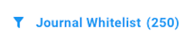
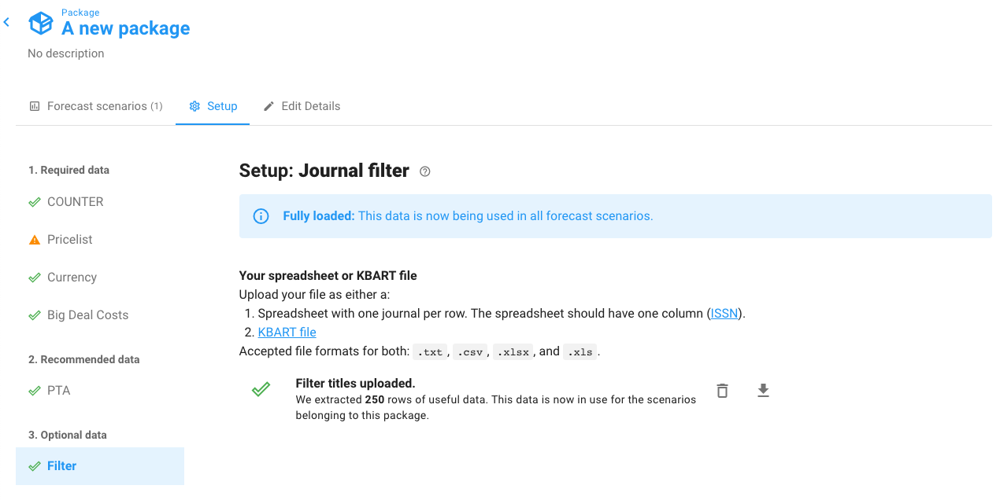

# What does the "Journal Whitelist" alert mean?

Do you have a warning like this at the top of your Forecast Scenario?

If so, it's because you uploaded a whitelist of titles.&#x20;

Only titles in your whitelist will be included in your scenario. All others will be excluded.

To find out which journals you're whitelisting go to the Package page (you can click its name in the top left corner of your screen), then view the Setup tab, and finally select the **Filter** menu option. Click the down arrow to download a spreadsheet showing the titles in your whitelist.

You can delete your whitelist file at any time by clicking the trashcan icon.&#x20;

See the [Upload journal filter](../how-to-guides/upload-journal-filter.md) page for more details.
