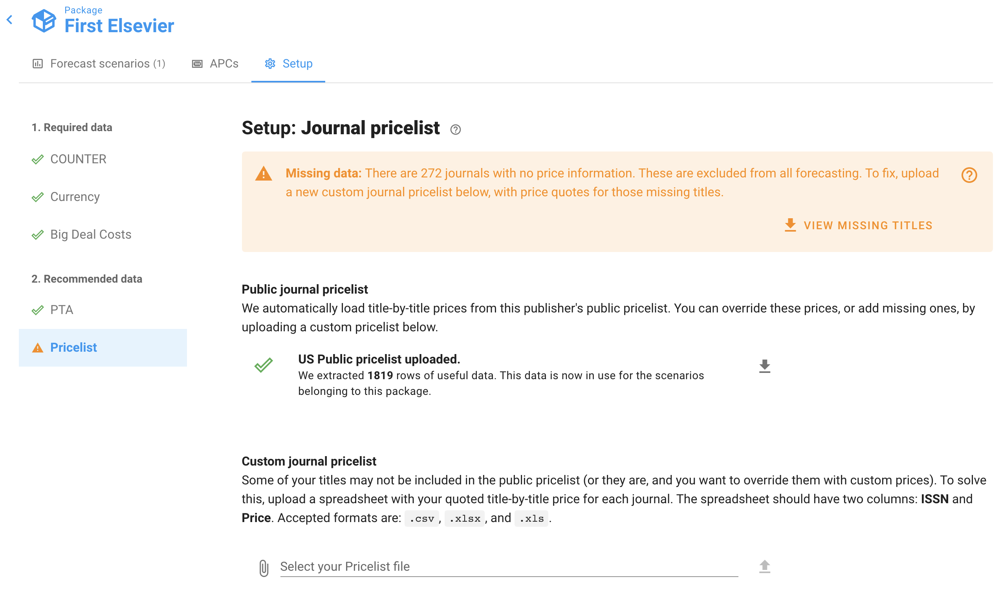

# What does the "Missing Prices" warning mean?

Do you have a warning like this at the top of your Forecast Scenario?

If so, it's because we don't know the subscription price for some of the journals in your COUNTER reports.

We'd like to include these journals in the forecast scenario, but we can't, because without a title-level subscription price, we can't calculate its title-level cost per use.

So, **any journals with missing prices are omitted from your forecasting dashboards.** That makes the forecasting less useful to you, since we're just ignoring some journals that might be important.

Ideally, we'd be able to load these missing prices in automatically. And indeed, for the major publishers we do indeed preload _most_ title-by-title prices by default. However, unfortunately the publishers do not make their _full_ pricelists publically available. That means you'll need to contact your sales representative to get a quote for these missing prices.

To find out which journals are missing prices: go to the Package page (you can click its name in the top left corner of your screen), then view the Setup tab, and finally select the "Pricelist" menu option. Click "View Journals" to download a spreadsheet showing the missing journals. These are the ones you'll need to ask a quote for.

Once you've got price quotes for the missing titles, you can then upload a custom Journal Pricelist file and resolve the warning. See [this article](../how-to-guides/upload-title-prices.md) for details on how to format and upload your Pricelist file.
