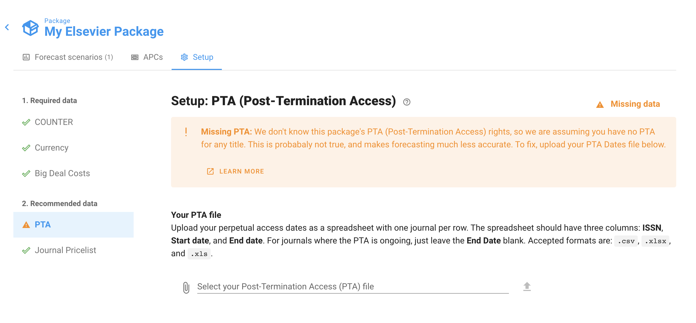

# What does the "Missing PTA" warning mean?

Do you have a warning like this at the top of your Forecast Scenario?

If so, it's because you haven't yet loaded a Post-Termination Access (PTA) file to this Package.

PTA goes by a variety of names. It is sometimes called Backfile, Post-Cancellation Access (PCA), or Perpetual Access (PA).

**Loading a PTA dates file into Unsub is important to get an accurate forecast estimate** — it allows us to know what (if any) fulfillment you can expect from your post-termination sources if you cancel your current subscriptions.

If you haven't loaded in any PTA dates, we assume you don't have any Post-Termination Access. **This means we are likely underestimating** the amount of Access in your cancellation scenarios -- in our experience most universities can fulfill about 12%-25% of usage via Post-Termination Access, over and above what is available through Open Access.

To fix this warning: go to the Package page (you can click its name in the top left corner of your screen), then view the Setup tab, and finally select the "PTA" menu option. Then upload a file with your PTA dates. See [this article](http://help.unsub.org/en/articles/4203970-how-do-i-upload-custom-perpetual-access-dates) for details on how to format and upload that PTA file.

