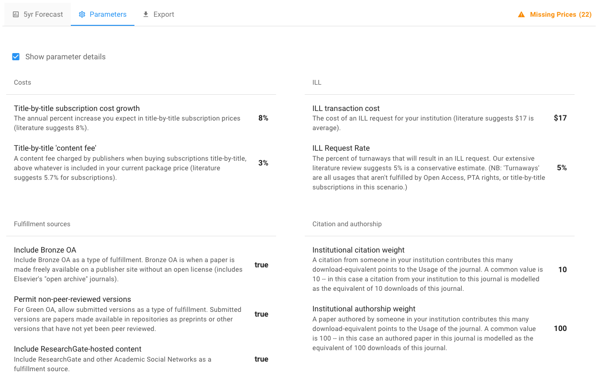

# Comparing scenarios


Have you created a scenario yet? If not go [do that now](create-and-work-with-scenarios.md).


Within an Unsub package you can have as many scenarios as you like.&#x20;

Comparing different scenarios is a powerful way to compare different choices about subscribed titles and scenario parameters. Remember, scenarios within a package share the same COUNTER, PTA and title price data - those data do not differ among scenarios within a package.

### Compare scenarios

Here, we'll compare two scenarios. If you haven't created a scenario yet, follow the [Create a scenario](create-and-work-with-scenarios.md) tutorial to create a scenario now.&#x20;

After creating a scenario [make a copy of the scenario](../how-to-guides/copy-a-scenario.md).&#x20;

On creating a copy of a scenario you are dropped into the copied scenario. In the copied scenario let's change one parameter setting then compare results.&#x20;

Click on the Parameters tab in your copied scenario. You should now see a page of the nine parameters.&#x20;

For this tutorial we'll change one of the Fulfillment sources parameters: **Include Bronze OA**

By default **Include Bronze OA** is **true**. Click on that parameter and click the blue button to turn it to false, then click Save.

You should now see a change in your forecast.&#x20;

Now navigate to the package page with your two scenarios: the original scenario you created, and the copied scenario.&#x20;

You should see something like:

In the above view you can easily see the difference in Cost and Access between your scenarios. In the example above the two scenarios are identical except for the **Include Bronze OA** parameter (true in "First Scenario", false in "Copy of First Scenario").&#x20;

Cost is about $24,000 less and access 3% higher in "First Scenario" relative to "Copy of First Scenario".&#x20;

As you add more scenarios you can compare cost and access across them all.&#x20;

## **What's Next?**

The next step is learning about the Unsub [Consortial Dashboard](consortial-dashboard.md).&#x20;


Note: Most Unsub users **DO NOT** have a consortial dashboard.

