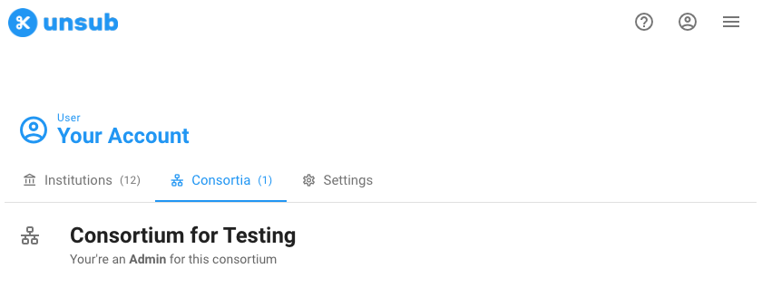
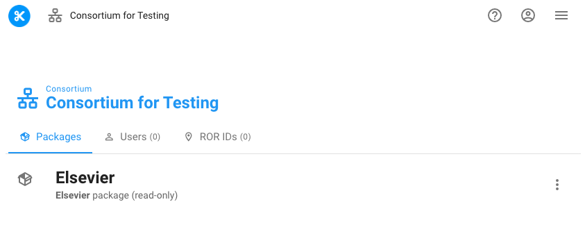
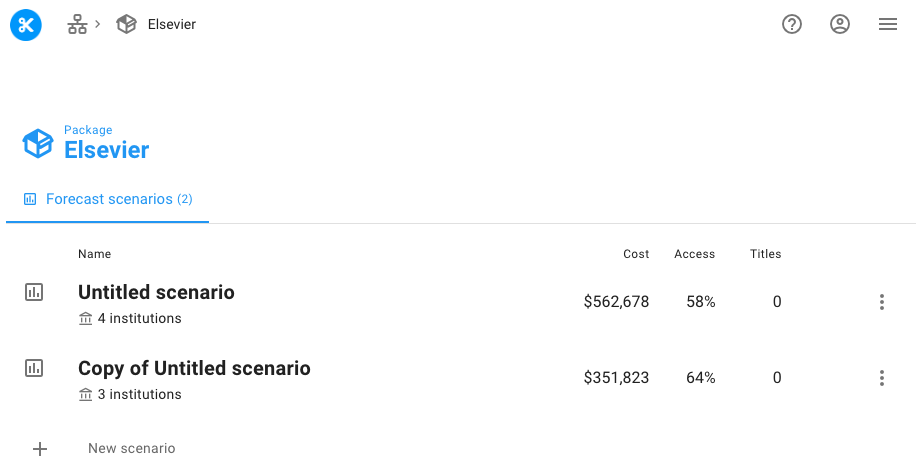
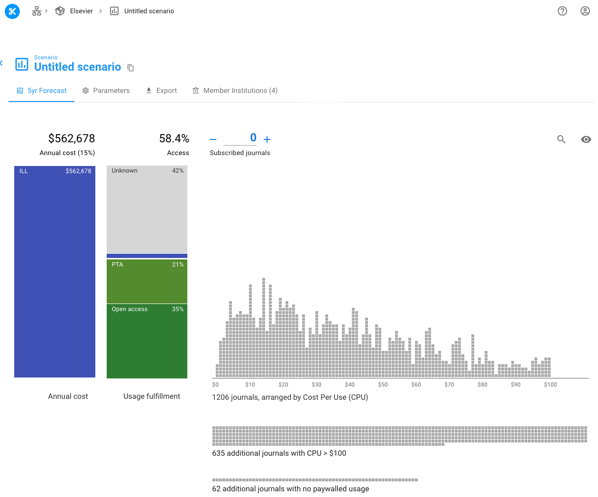
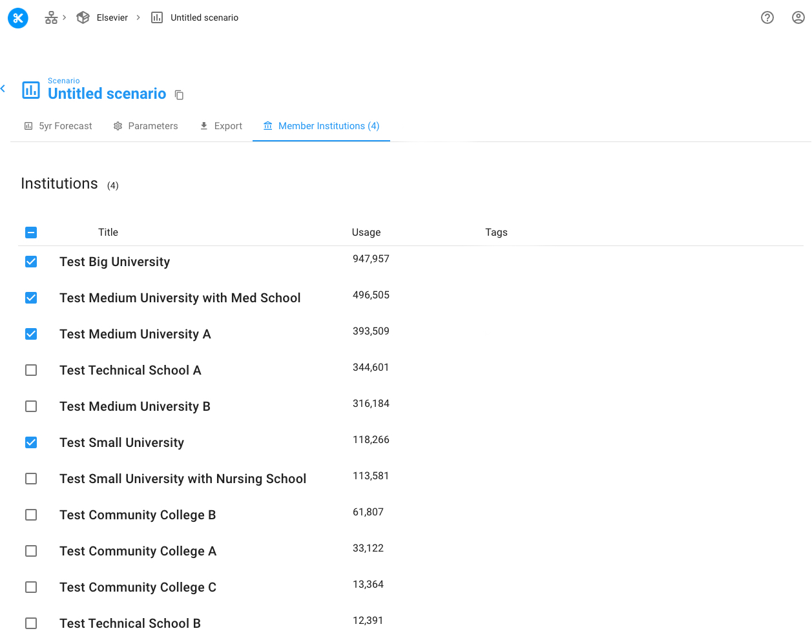

# Consortial dashboard


Most Unsub users do not have a consortial dashboard - nothing is amiss if you don't see the consortial dashboard in your Unsub account (unless you've asked for one and don't see it yet). If you are a consortium and would like to have a consortial dashboard get in touch at [support@unsub.org](mailto:support@unsub.org)


## 1 Find your consortium dashboard

If you have a consortium dashboard, when you login to Unsub you'll see a tab labeled **Consortia**. See below screenshot for an example.

## 2 Navigate to the consortial dashboard

After finding the **Consortia** click on the consortium listed on the tab. In this case it's called "Consortium for Testing".&#x20;

You should then see a new page like the below screenshot:

In the above example there is one package (**Elsevier**). You can create as many consortial Unsub packages as you like.&#x20;

On this page you can also see tabs for:

* Users: The users that have access to the consortial dashboard.
* ROR IDs: The ROR identifiers associated with this consortial dashboard. The ROR identifier here isn't used to link data together.

## 3 Consortial package view

From the listing of packages for your consortium click on any one of the packages to see what's inside the package.


Unsub users can not currently create their new packages. Get in touch with us to create new packages: [support@unsub.org](mailto:support@unsub.org)


The above screenshot shows what's inside a consortial package. Just as a normal Unsub dashboard, the consortial dashboard lists the scenarios you've created. You can create a new scenario - you can create as many scenarios as you like.

There's just one major difference here from the institutional Unsub dashboard: the number of institutions is listed under each scenario. You can include any subset of the institutions within your consortium in any scenario. That is, you can include different institutions in different scenarios and compare those scenarios to help the decision making process.

## 4 Consortial dashboard (scenario)

Clicking on the first scenario in the above screenshot we get to the Unsub dashboard.&#x20;

The major difference here from the institutional Unsub dashboard is that there is a new tab for **Member Institutions**.&#x20;

If you click on the Member Institutions tab you get a list of the institutions included in your consortial package.

## 5 Understanding the consortial dashboard

Using the consortial dashboard is just like using the institutional dashboard. You can see how changing parameters, and subscribing to titles a-la-carte changes your forecasts.&#x20;

The values in the consortial dashboard are accumulated from the member institutions included in the **Member Institutions** tab, so whenever you change the institutions included your forecast will change.&#x20;

Just like the normal institutional dashboard, you can look at the table view of all the titles in your dashboard, and you export the data.&#x20;

Please get in touch if you have any questions about the consortial dashboard ([support@unsub.org](mailto:support@unsub.org)).&#x20;
