# Create a package


Have you logged into your account yet? If not, [do that now](logging-in.md).


In this tutorial you will learn how to create a package in Unsub.

What is a package? A package is a container of sorts that holds your forecast scenarios for journals from one or more publishers. Think of a package as the thing you want to set up when you are starting to consider whether to renew a deal with a publisher/aggregator. An Unsub package is analogous to your subscription package for a publisher/aggregator.

## 1 Create a new package

Click on your institution’s name. The below image is for “A Demo University”. Look for the name of your institution. If there are multiple institutions, pick the one that you want to create a package for.

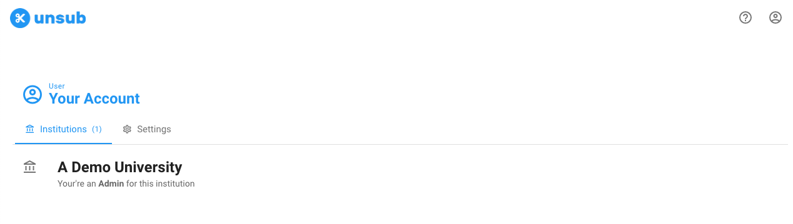

Once you’re in your institution, if no packages have been created you’ll just see the below button. To create your first package, click + **New package**.

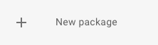

You’ll get a popup window titled **Add subscription package**

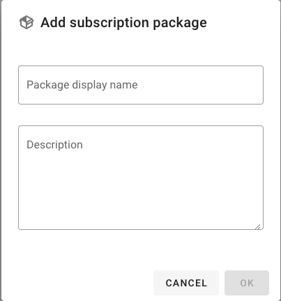

Type in a Package display name. A package name is required to create a package.&#x20;

Optionally, supply a Description for your package. The Description could contain any information - aim to help remind your colleagues and yourself later about important details about the package.&#x20;

(You can change both the package name and description later.)

Then press OK, and you’ve now created your package!

After clicking **OK** you’ll land on the packages page where we list all of your packages. Remember, you can create as many packages as you want, and each package handles one publisher.

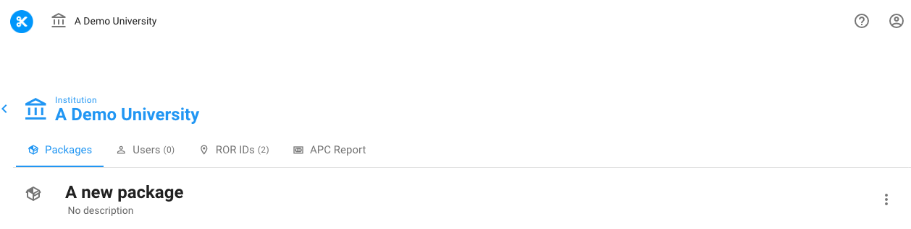

## 2 Setup your package

After the package is created it’s time to setup the package. There are four required steps, one strongly recommended step, and one optional step:

Required

* Upload COUNTER usage data
* Upload custom title price file
* Set your currency
* Set your big deal costs

Strongly recommended

* Upload post-termination access file

Optional

* Upload white list of titles

Below is a graphical guide to setup - we'll address scenario aspects in later tutorials, but this gives you a more complete picture of setup:

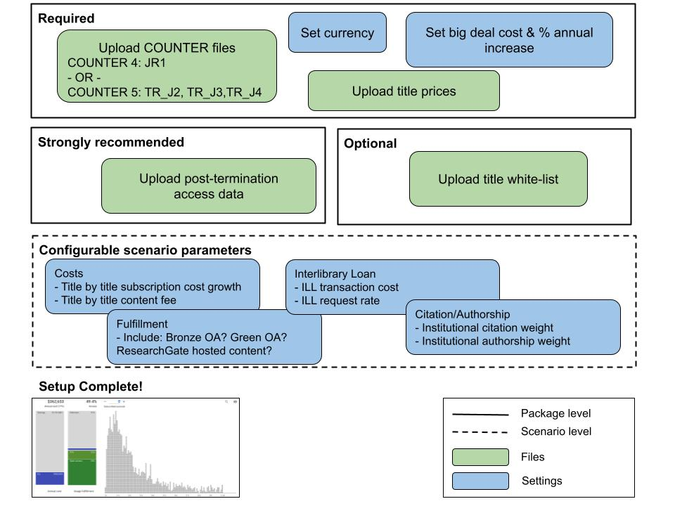

Make sure you have the files and information for the Required section. It would also be good to have the files available for the Recommended section, but if you do not have them you can come back to this tutorial later.

As this is a new package the screen should look like the below image (with the four Required data tabs with a red ❌ - indicating that they still need to be set by the user).

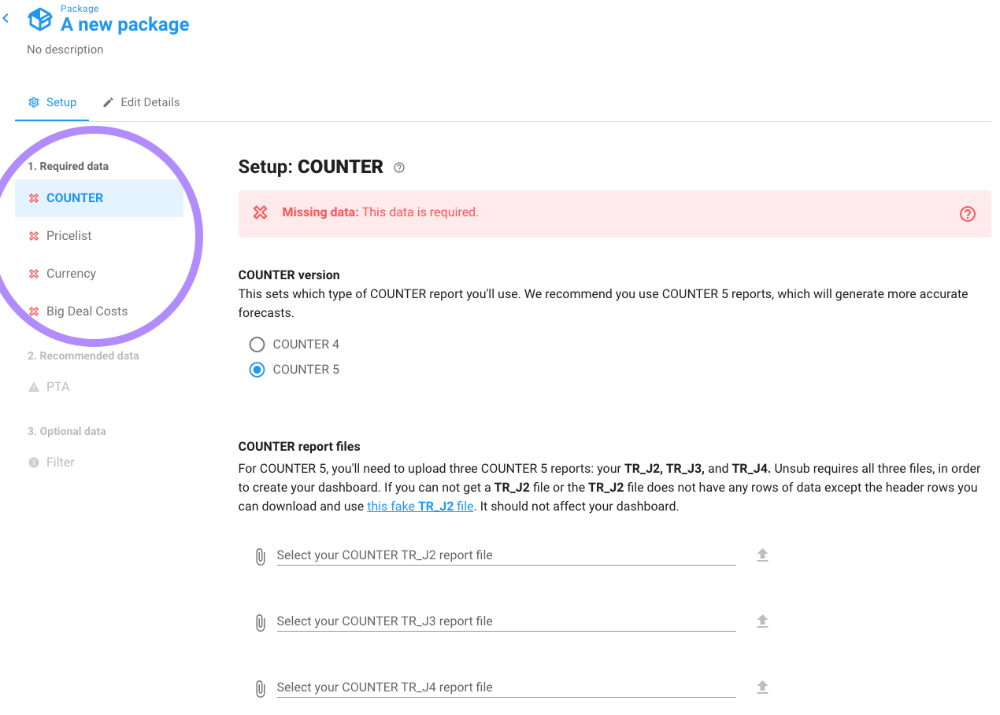

There is also one greyed out tab under recommended data (PTA), and one greyed out tab under optional data (Filter). You can’t access those tabs until you address the four required data tabs.

### 2.1 COUNTER usage

Usage data by journal for your institution is the most crucial piece of data for your Unsub forecast.

Click on COUNTER on the left hand side of the Setup screen.

You should see the below page, with a red alert indicating that you need to add your COUNTER data files. We support [COUNTER 4](https://www.projectcounter.org/code-of-practice-sections/archived-code-of-practice-release-4/) and [COUNTER 5](https://cop5.projectcounter.org/en/5.0.2/). For COUNTER 4 you'll need to upload one file (JR1), and for COUNTER 5 you'll need to upload three files (TR\_J2, TR\_J3, TR\_J4).

Next, upload your files: for each of JR1, TR\_J2, TR\_J3, TR\_J4, navigate to where your file is, select it, then press the up arrow to the right. The upload for the file will then begin.&#x20;

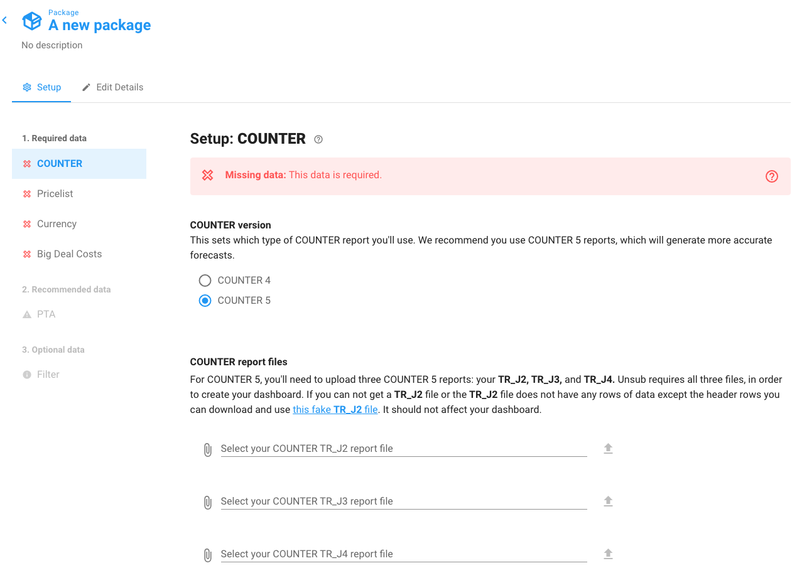

As you upload files, the Unsub page will let you know if there were any problems with the uploaded files.

Check out [Upload COUNTER usage data](../how-to-guides/upload-counter-usage-data.md) for more details on uploading COUNTER usage data.


While COUNTER data is uploading you can go to Pricelist, Currency, and Big Deal Costs tabs and set those values.


### 2.2 Title prices

Next click on **Pricelist** on the left-hand side. The screen should now show:

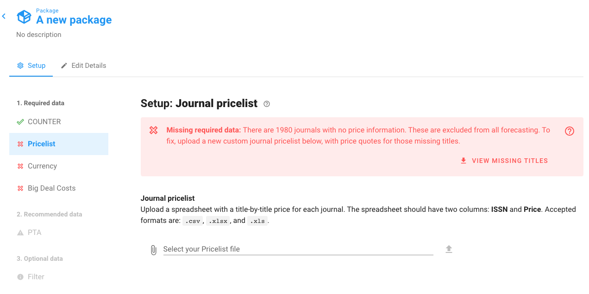

Note the red alert informs you how many journals have no price information, and also provides a file you can download which lists the journal with missing title prices.

You may not have your title prices for at this time. If not, click "View Missing Titles" on the red warning box. This will download a spreadsheet with the ISSNs, Titles, and an approximate sum of your COUNTER data for that title so that you know how important it is to you to make sure you get the price reflected in your Unsub dashboard.

With the missing titles spreadsheet, go to your Sales Representative for the publisher(s)/aggregator and ask for individual/a-la-carte title prices.

After getting title prices from your Sales Representative, see our [article on title prices](../how-to-guides/upload-title-prices.md) for the proper formatting.&#x20;

Once you have your title pricelist file upload it by navigating to the file on your computer, then press the up arrow to the right.

### 2.3 Currency

Next, go to the Currency tab on the left hand side of the screen. Once you click on Currency you should see the following on your screen:

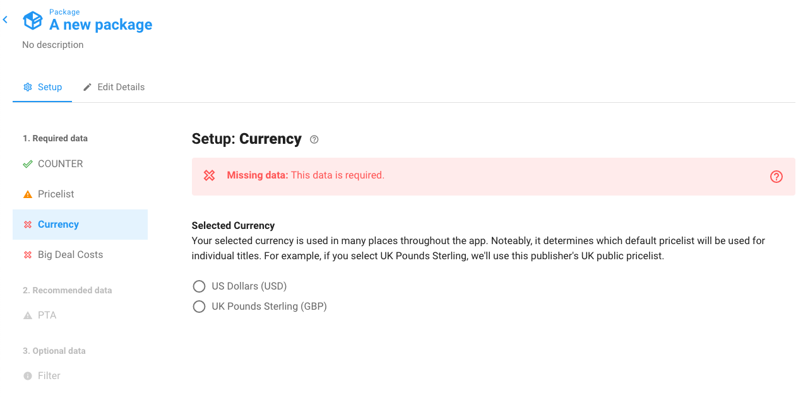

Select either USD or GBP.  As the alert states in the image above, the currency selection determines which public pricelist will be used for title prices.

Check out [Set currency](../how-to-guides/set-currency.md) for more details on setting currency.

### 2.4 Big Deal costs

Next, click on Big Deal Costs on the left hand side of the screen. You should see the following on your screen:

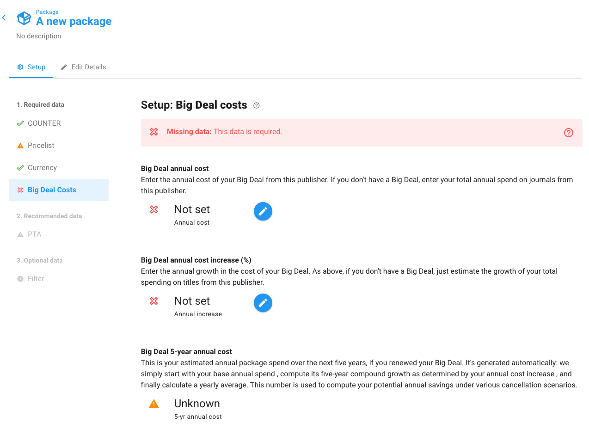

Set your Big Deal annual cost and Big Deal annual cost increase.

Check out [Set Big Deal cost and cost increase](../how-to-guides/set-big-deal-costs.md) for more details on setting big deal costs.

### 2.5 Perpetual access

At this point you have filled out the four required data sections (COUNTER, Pricelist, Currency and Big Deal Costs). You can now exit package setup and [make a scenario](create-and-work-with-scenarios.md). However, for the purposes of this tutorial let us proceed with this one Recommended step. Or, you can go on to [Creating a scenario](create-and-work-with-scenarios.md) and come back to this later.

Click on **PTA** on the left-hand side of the screen. You should see on your screen:

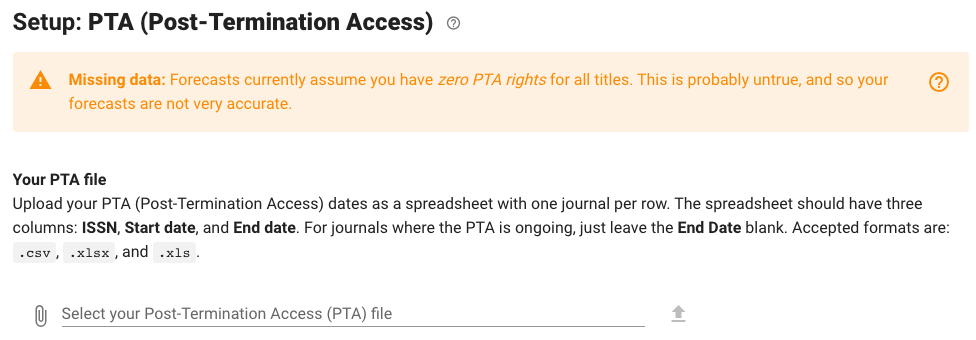

The orange alert informs you that you should make an effort to upload your PTA data to have an accurate forecast.

You may not have your PTA data for the publisher at this time. If not, see tips on [gathering your PTA data](../how-to-guides/post-termination-access-data.md) and [how to format the data](../how-to-guides/upload-pta-data.md), then revisit this tutorial.

Once you have your PTA file upload it by navigating to the file on your computer, then press the up arrow to the right.&#x20;

Check out [Upload PTA data](../how-to-guides/upload-pta-data.md) for instructions on PTA file format, and how to upload your PTA data.

### 2.6 Filter

You can optionally filter the titles that appear in all scenarios in your package to a "whitelist" of journals. If you change your mind after applying the filter you can delete the file from the setup page and you'll get back to your unfiltered dashboards.&#x20;

Click on **Filter** on the left-hand side of the screen. You should see on your screen:

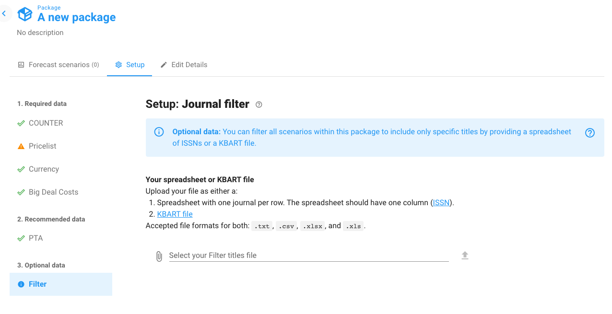

To find out more about journal filtering see our article [Upload journal filter](../how-to-guides/upload-journal-filter.md).

## What's Next?

Now that you’ve created a package, the next step is to [create one or more scenarios within the package](create-and-work-with-scenarios.md)
