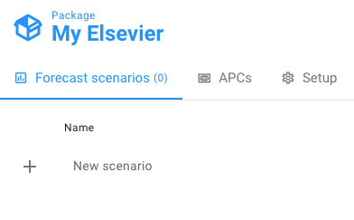
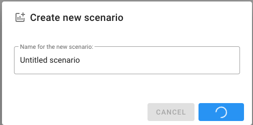
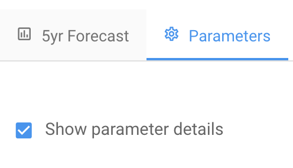
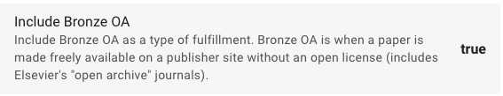
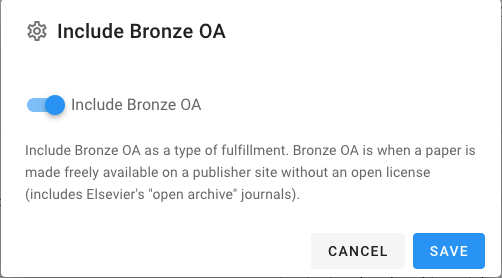
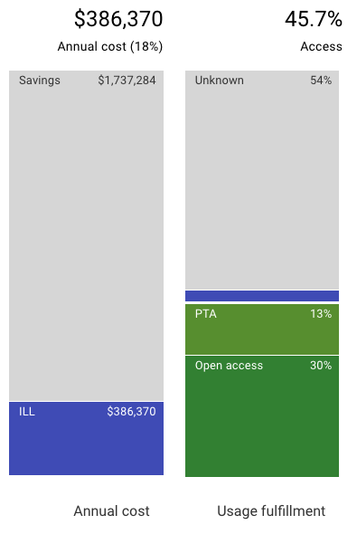

# Create and work with scenarios


Have you created a package yet? If not go [do that now](create-a-package.md).


In this tutorial you will learn how to create and work with [scenarios](../reference/scenarios/) in Unsub.

## 1 Create a new scenario

If you are not already in a package, click on the package you created in the [Create a package tutorial](create-a-package.md) (or any other package in your account), and you should see

From here, click on "**+ New scenario"**.

The pop up will ask you to name the scenario (default is “Untitled scenario”)

It will take a little while for the new scenario to be created. During scenario creation, you'll see a spinning circle like

Once it's complete you’ll be redirected to the new scenario, and you should see something generally like this. The details of every scenario vary widely depending on what you've done in your setup for the package, and your institution.&#x20;

See also: [How do I add a new scenario](../how-to-guides/how-do-i-add-a-new-scenario.md)?

For a thorough explanation of Unsub scenarios see the [Scenarios](../reference/scenarios/) reference page.

## **2 Set scenario parameters**

Click the **Parameters** tab

The first thing to notice is that you can toggle on or off the description (details) for each parameter.

By default the parameter details are shown.

There are nine different parameters you can configure. We encourage you to look into each of them. However, for this tutorial we'll explore just one of the parameters: Bronze OA.&#x20;

Bronze OA is when a paper is made freely available on a publisher website without an open license - in which case the paper could be taken down at any time.&#x20;

By default we include Bronze OA (Open Access) in our forecasts.&#x20;

Looking at the Parameters tab, **Include Bronze OA** should look like this:

Now, click anywhere on the area of the parameter name, description, or the value (in this case **true**). You'll then get a popup like:

Click on the area on the popup with the blue switch and the text **Include Bronze OA**. That click should move the switch to the left and turn it white looking like:

Then click **Save**. You're done! Your scenario now will not include Bronze OA.&#x20;

To make sure changing this parameter changed the scenario, let's compare screenshots of the scenario before and after changing the Bronze OA parameter. Although the entire scenario changes, let's focus on the Cost and Access bars on the left of the scenario.&#x20;

**Include Bronze OA = true**

**Include Bronze OA = false**

Comparing the two images above, you can see that cost has changed, with higher ILL costs when Bronze OA is not included - more money needs to be spent on ILL to fulfill article requests. In addition, access has changed: open access fulfillment dropped from 35% when including Bronze OA to 30% when we didn't include Bronze OA.

For a description of each scenario parameter see our article on [Scenario parameters](../reference/scenario-parameters.md).

## **3 Subscribe title by title**

Unsub helps you subscribe title by title using our advanced version of [**Cost Per Use** (CPU)](../reference/cost-per-use-cpu.md).&#x20;

You can use our approach whether you:&#x20;

* are planning to cancel a big deal and want to know what cost and access you'll have via ala carte subscriptions
* are curious about getting a better big deal and want a comparison point (big deal vs. no big deal w/ ala carte)
* already cancelled your big deal and want to get an accurate forecast of your ala carte subscriptions

We make it super easy to subscribe title by title using CPU. It's as easy as adding or subtracting one title at a time with two button clicks. Locate the area on your scenario with the - and + that says "Subscribed journals", and there should be a zero in between the - and +. When there are zero subscribed journals you should see all grey squares in your scenario - and no blue squares.

Click the + sign once. You have now subscribed to one journal, and you should now see one blue square. The blue square will be the left and lower-most square in the scenario.&#x20;

You can continue to press the + button to add titles by CPU, or press the - button to remove titles by CPU.&#x20;

## **What's Next?**

Now that you’ve created a scenario and learned the basics of how to work with it, the next step is a more detailed look at [Subscribing title by title](subscribing-title-by-title.md)

