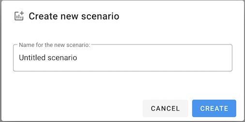

# Create a scenario


Have you created a package yet? If not go [do that now](create-a-package.md).


In this tutorial you will learn how to create and work with [scenarios](../reference/scenarios/) in Unsub.

If you are not already in a package, click on the package you created in the [Create a package tutorial](create-a-package.md) (or any other package in your account), and you should see

From here, click on "**+ New scenario"**.

The pop up will ask you to name the scenario (default is “Untitled scenario”)

It will take a little while for the new scenario to be created. During scenario creation, you'll see a spinning circle like

Once it's complete you’ll be redirected to the new scenario, and you should see something generally like this. The details of every scenario vary widely depending on what you've done in your setup for the package, and your institution.&#x20;

See also: [How do I add a new scenario](../how-to-guides/add-a-new-scenario.md)?

For a thorough explanation of Unsub scenarios see the [Scenarios](../reference/scenarios/) reference page.

## **What's Next?**

Now that you’ve created a scenario, the next step is [Subscribing title by title](subscribing-title-by-title.md)

