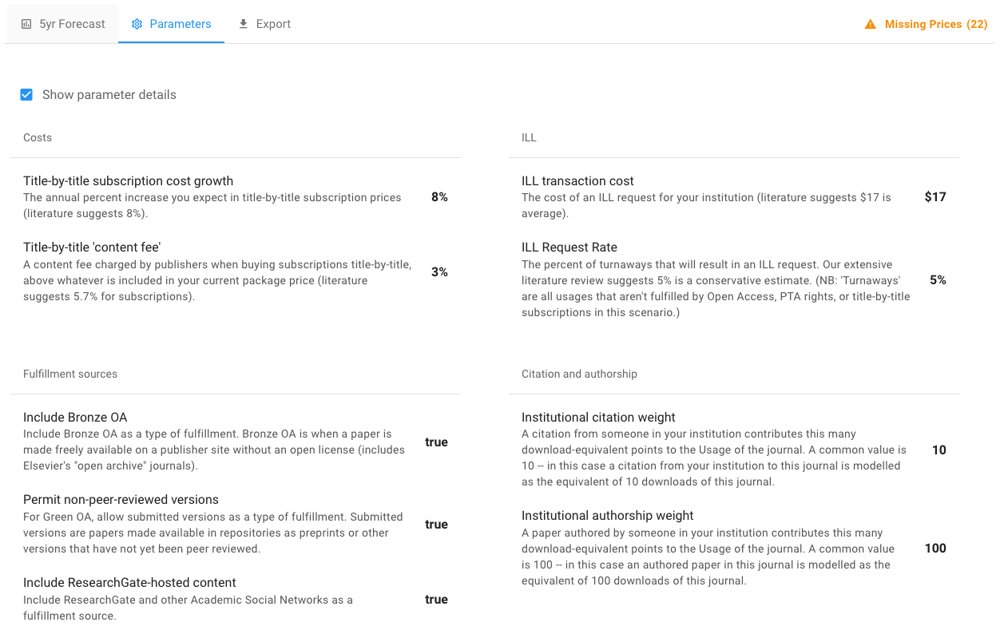
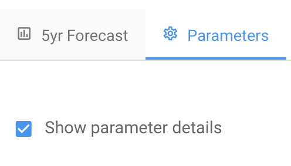
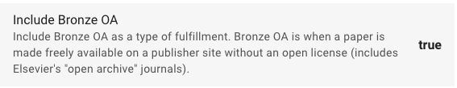
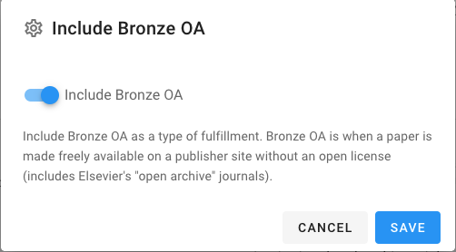
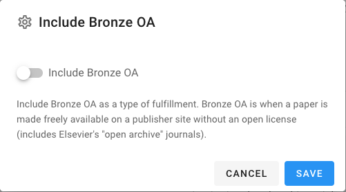
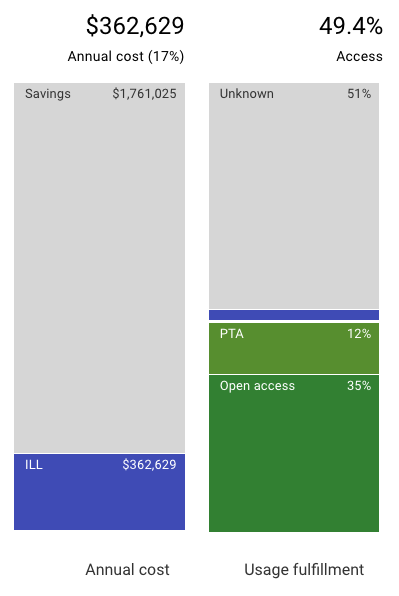
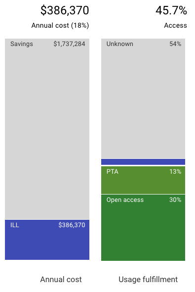

# Set scenario parameters


Have you created a scenario yet? If not go [do that now](create-and-work-with-scenarios.md).


Click the **Parameters** tab

You should see a page of the nine parameters and their details

The first thing to notice is that you can toggle on or off the description (details) for each parameter.

By default the parameter details are shown.

There are nine different parameters you can configure. We encourage you to look into each of them. However, for this tutorial we'll explore just one of the parameters: Bronze OA.&#x20;

Bronze OA is when a paper is made freely available on a publisher website without an open license - in which case the paper could be taken down at any time.&#x20;

By default we include Bronze OA (Open Access) in our forecasts.&#x20;

Looking at the Parameters tab, **Include Bronze OA** should look like this:

Now, click anywhere on the area of the parameter name, description, or the value (in this case **true**). You'll then get a popup like:

Click on the area on the popup with the blue switch and the text **Include Bronze OA**. That click should move the switch to the left and turn it white looking like:

Then click **Save**. You're done! Your scenario now will not include Bronze OA.&#x20;

To make sure changing this parameter changed the scenario, let's compare screenshots of the scenario before and after changing the Bronze OA parameter. Although the entire scenario changes, let's focus on the Cost and Access bars on the left of the scenario.&#x20;

**Include Bronze OA = true**

**Include Bronze OA = false**

Comparing the two images above, you can see that cost has changed, with higher ILL costs when Bronze OA is not included - more money needs to be spent on ILL to fulfill article requests. In addition, access has changed: open access fulfillment dropped from 35% when including Bronze OA to 30% when we didn't include Bronze OA.

For a description of each scenario parameter see our article on [Scenario parameters](../reference/scenarios/scenario-parameters.md).

## **What's Next?**

Now that you’ve created set scenario parameters, the next step is [Comparing Scenarios](comparing-scenarios.md)
